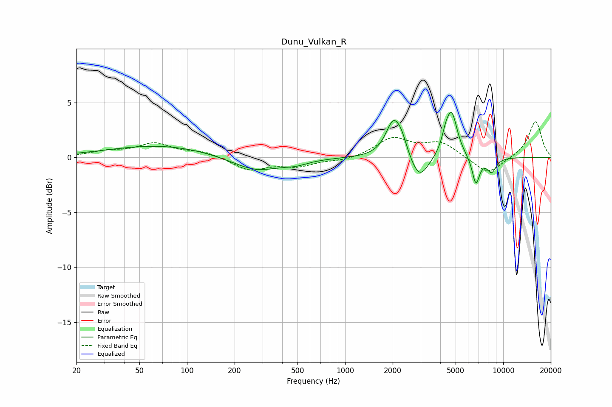

# Dunu_Vulkan_R
See [usage instructions](https://github.com/jaakkopasanen/AutoEq#usage) for more options and info.

### Parametric EQs
Apply preamp of -4.2 dB when using parametric equalizer.

|   # | Type    |   Fc (Hz) |    Q |   Gain (dB) |
|-----|---------|-----------|------|-------------|
|   1 | Peaking |        67 | 0.44 |         1.1 |
|   2 | Peaking |       273 | 0.91 |        -1.3 |
|   3 | Peaking |       490 | 1.86 |        -0.4 |
|   4 | Peaking |      2025 | 2.88 |         3.3 |
|   5 | Peaking |      2288 | 4.32 |         1   |
|   6 | Peaking |      2951 | 2.5  |        -2.3 |
|   7 | Peaking |      4317 | 6    |         1   |
|   8 | Peaking |      4723 | 3.87 |         4   |
|   9 | Peaking |      6716 | 5.77 |        -2.5 |
|  10 | Peaking |      8439 | 4.4  |        -1.3 |

### Fixed Band EQs
When using fixed band (also called graphic) equalizer, apply preamp of **-3.3 dB** (if available) and set gains manually with these parameters.

|   # | Type    |   Fc (Hz) |    Q |   Gain (dB) |
|-----|---------|-----------|------|-------------|
|   1 | Peaking |        31 | 1.41 |         0.5 |
|   2 | Peaking |        62 | 1.41 |         1.2 |
|   3 | Peaking |       125 | 1.41 |         0.5 |
|   4 | Peaking |       250 | 1.41 |        -1.1 |
|   5 | Peaking |       500 | 1.41 |        -0.7 |
|   6 | Peaking |      1000 | 1.41 |        -0.3 |
|   7 | Peaking |      2000 | 1.41 |         1.7 |
|   8 | Peaking |      4000 | 1.41 |         1.3 |
|   9 | Peaking |      8000 | 1.41 |        -1.6 |
|  10 | Peaking |     16000 | 1.41 |         3.3 |

### Graphs

