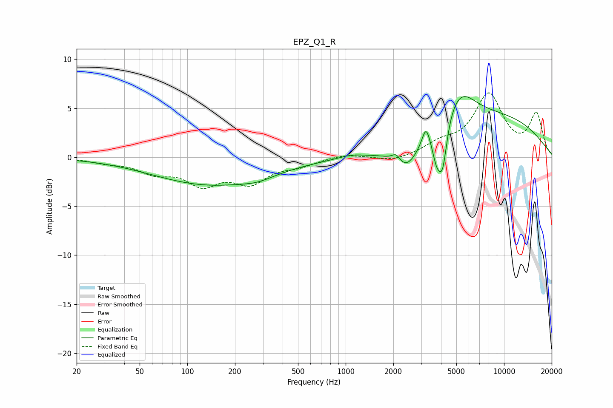

# EPZ_Q1_R
See [usage instructions](https://github.com/jaakkopasanen/AutoEq#usage) for more options and info.

### Parametric EQs
Apply preamp of -6.3 dB when using parametric equalizer.

|   # | Type    |   Fc (Hz) |    Q |   Gain (dB) |
|-----|---------|-----------|------|-------------|
|   1 | Peaking |       142 | 0.38 |        -2.8 |
|   2 | Peaking |       278 | 1.48 |        -0.4 |
|   3 | Peaking |      1080 | 1.92 |         0.3 |
|   4 | Peaking |      2084 | 5.15 |         0.9 |
|   5 | Peaking |      2411 | 1.81 |        -2.6 |
|   6 | Peaking |      3216 | 5.86 |         1.9 |
|   7 | Peaking |      3756 | 4.91 |        -2.7 |
|   8 | Peaking |      4099 | 5.11 |        -4.4 |
|   9 | Peaking |      5189 | 1.38 |         3.5 |
|  10 | Peaking |      8818 | 0.35 |         4   |

### Fixed Band EQs
When using fixed band (also called graphic) equalizer, apply preamp of **-6.7 dB** (if available) and set gains manually with these parameters.

|   # | Type    |   Fc (Hz) |    Q |   Gain (dB) |
|-----|---------|-----------|------|-------------|
|   1 | Peaking |        31 | 1.41 |        -0.4 |
|   2 | Peaking |        62 | 1.41 |        -1.4 |
|   3 | Peaking |       125 | 1.41 |        -2.5 |
|   4 | Peaking |       250 | 1.41 |        -2.3 |
|   5 | Peaking |       500 | 1.41 |        -0.7 |
|   6 | Peaking |      1000 | 1.41 |         0.4 |
|   7 | Peaking |      2000 | 1.41 |        -0.5 |
|   8 | Peaking |      4000 | 1.41 |         1.1 |
|   9 | Peaking |      8000 | 1.41 |         6.2 |
|  10 | Peaking |     16000 | 1.41 |         4.3 |

### Graphs

