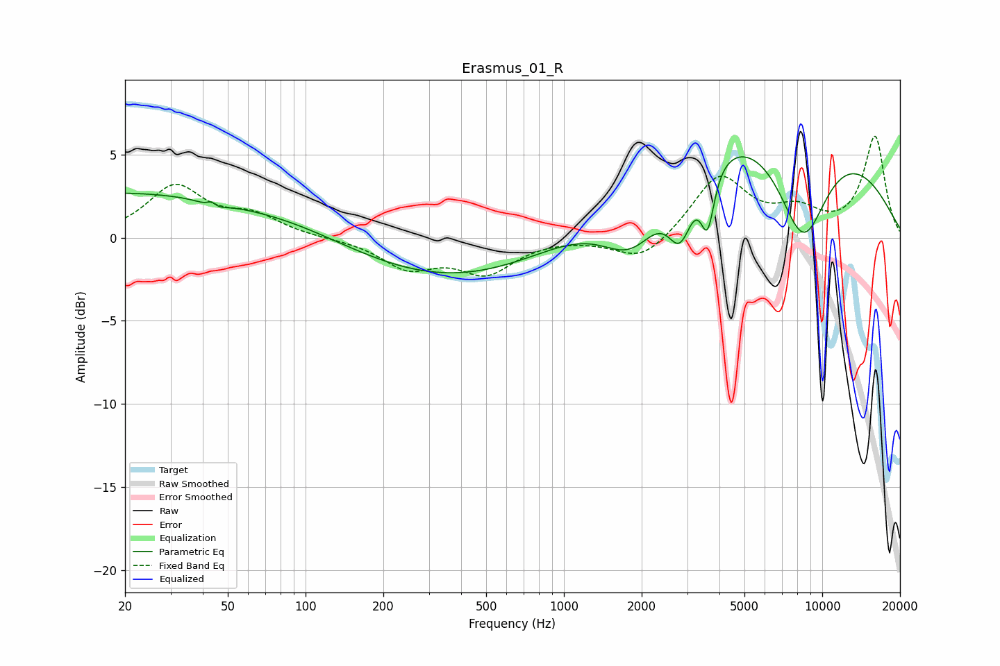

# Erasmus_01_R
See [usage instructions](https://github.com/jaakkopasanen/AutoEq#usage) for more options and info.

### Parametric EQs
Apply preamp of -5.0 dB when using parametric equalizer.

|   # | Type    |   Fc (Hz) |    Q |   Gain (dB) |
|-----|---------|-----------|------|-------------|
|   1 | Peaking |        22 | 0.18 |         2.8 |
|   2 | Peaking |        43 | 5.9  |         2.8 |
|   3 | Peaking |        44 | 5.28 |        -2.8 |
|   4 | Peaking |        53 | 0.92 |        -0.2 |
|   5 | Peaking |       511 | 0.27 |        -3.2 |
|   6 | Peaking |      1842 | 1.14 |        -4.3 |
|   7 | Peaking |      2821 | 2.87 |        -3.7 |
|   8 | Peaking |      3600 | 5.3  |        -3.6 |
|   9 | Peaking |      5198 | 0.21 |         8.1 |
|  10 | Peaking |      8418 | 1.29 |        -6.9 |

### Fixed Band EQs
When using fixed band (also called graphic) equalizer, apply preamp of **-6.2 dB** (if available) and set gains manually with these parameters.

|   # | Type    |   Fc (Hz) |    Q |   Gain (dB) |
|-----|---------|-----------|------|-------------|
|   1 | Peaking |        31 | 1.41 |         3   |
|   2 | Peaking |        62 | 1.41 |         1.2 |
|   3 | Peaking |       125 | 1.41 |        -0   |
|   4 | Peaking |       250 | 1.41 |        -1.7 |
|   5 | Peaking |       500 | 1.41 |        -2   |
|   6 | Peaking |      1000 | 1.41 |         0   |
|   7 | Peaking |      2000 | 1.41 |        -1.5 |
|   8 | Peaking |      4000 | 1.41 |         3.7 |
|   9 | Peaking |      8000 | 1.41 |         1.4 |
|  10 | Peaking |     16000 | 1.41 |         6   |

### Graphs

