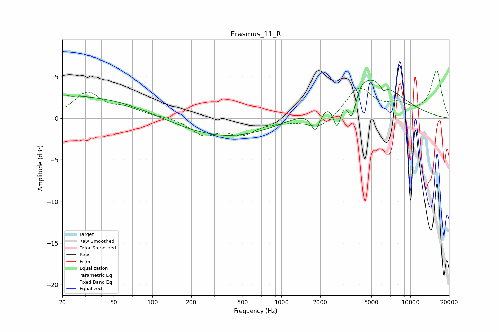

# Erasmus_11_R
See [usage instructions](https://github.com/jaakkopasanen/AutoEq#usage) for more options and info.

### Parametric EQs
Apply preamp of -4.7 dB when using parametric equalizer.

|   # | Type    |   Fc (Hz) |    Q |   Gain (dB) |
|-----|---------|-----------|------|-------------|
|   1 | Peaking |        20 | 0.27 |         2.5 |
|   2 | Peaking |        24 | 5.68 |         2.2 |
|   3 | Peaking |        24 | 6    |        -2.3 |
|   4 | Peaking |        75 | 0.39 |         0.6 |
|   5 | Peaking |       363 | 0.36 |        -2.4 |
|   6 | Peaking |      1840 | 3.8  |        -2.7 |
|   7 | Peaking |      2707 | 4.42 |        -3.7 |
|   8 | Peaking |      3521 | 4.12 |        -4   |
|   9 | Peaking |      4295 | 0.58 |         5.5 |
|  10 | Peaking |      6161 | 5.99 |        -0.8 |

### Fixed Band EQs
When using fixed band (also called graphic) equalizer, apply preamp of **-5.8 dB** (if available) and set gains manually with these parameters.

|   # | Type    |   Fc (Hz) |    Q |   Gain (dB) |
|-----|---------|-----------|------|-------------|
|   1 | Peaking |        31 | 1.41 |         3   |
|   2 | Peaking |        62 | 1.41 |         1   |
|   3 | Peaking |       125 | 1.41 |         0.2 |
|   4 | Peaking |       250 | 1.41 |        -1.9 |
|   5 | Peaking |       500 | 1.41 |        -1.7 |
|   6 | Peaking |      1000 | 1.41 |        -0.3 |
|   7 | Peaking |      2000 | 1.41 |        -1.4 |
|   8 | Peaking |      4000 | 1.41 |         3.6 |
|   9 | Peaking |      8000 | 1.41 |         1.3 |
|  10 | Peaking |     16000 | 1.41 |         5.7 |

### Graphs

