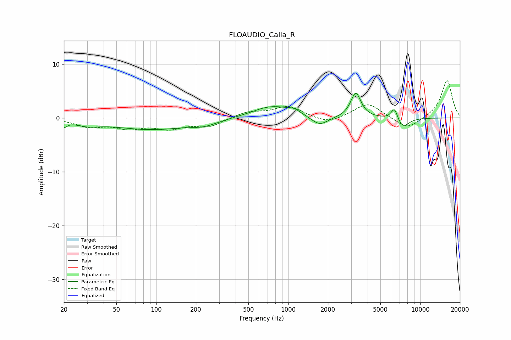

# FLOAUDIO_Calla_R
See [usage instructions](https://github.com/jaakkopasanen/AutoEq#usage) for more options and info.

### Parametric EQs
Apply preamp of -4.7 dB when using parametric equalizer.

|   # | Type    |   Fc (Hz) |    Q |   Gain (dB) |
|-----|---------|-----------|------|-------------|
|   1 | Peaking |        20 | 5.98 |        -1.1 |
|   2 | Peaking |        30 | 1.58 |        -0.9 |
|   3 | Peaking |        92 | 0.47 |        -2.1 |
|   4 | Peaking |       231 | 1.46 |        -0.8 |
|   5 | Peaking |       756 | 0.95 |         2.2 |
|   6 | Peaking |      1108 | 3.06 |         0.7 |
|   7 | Peaking |      1731 | 2.21 |        -1.8 |
|   8 | Peaking |      3255 | 3.67 |         4.6 |
|   9 | Peaking |      6385 | 5.44 |         2.3 |
|  10 | Peaking |      7376 | 2.89 |        -1.9 |

### Fixed Band EQs
When using fixed band (also called graphic) equalizer, apply preamp of **-7.0 dB** (if available) and set gains manually with these parameters.

|   # | Type    |   Fc (Hz) |    Q |   Gain (dB) |
|-----|---------|-----------|------|-------------|
|   1 | Peaking |        31 | 1.41 |        -1.5 |
|   2 | Peaking |        62 | 1.41 |        -1.6 |
|   3 | Peaking |       125 | 1.41 |        -1.7 |
|   4 | Peaking |       250 | 1.41 |        -1.5 |
|   5 | Peaking |       500 | 1.41 |         1.1 |
|   6 | Peaking |      1000 | 1.41 |         2.1 |
|   7 | Peaking |      2000 | 1.41 |        -1.2 |
|   8 | Peaking |      4000 | 1.41 |         2.8 |
|   9 | Peaking |      8000 | 1.41 |        -2.2 |
|  10 | Peaking |     16000 | 1.41 |         7.1 |

### Graphs

