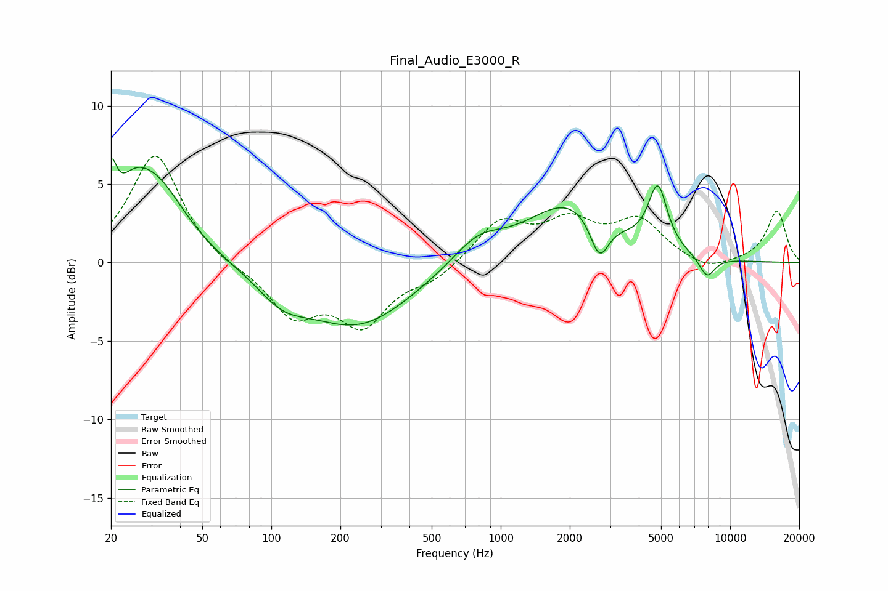

# Final_Audio_E3000_R
See [usage instructions](https://github.com/jaakkopasanen/AutoEq#usage) for more options and info.

### Parametric EQs
Apply preamp of -6.7 dB when using parametric equalizer.

|   # | Type    |   Fc (Hz) |    Q |   Gain (dB) |
|-----|---------|-----------|------|-------------|
|   1 | Peaking |        20 | 5.92 |         3.2 |
|   2 | Peaking |        25 | 2    |         1.9 |
|   3 | Peaking |        31 | 1.07 |         4.8 |
|   4 | Peaking |       112 | 1.31 |        -1.5 |
|   5 | Peaking |       238 | 0.6  |        -4   |
|   6 | Peaking |       794 | 1.28 |         1.6 |
|   7 | Peaking |      2008 | 0.76 |         3.8 |
|   8 | Peaking |      2691 | 3.38 |        -2.7 |
|   9 | Peaking |      4839 | 3.41 |         4   |
|  10 | Peaking |      7924 | 3.71 |        -1.3 |

### Fixed Band EQs
When using fixed band (also called graphic) equalizer, apply preamp of **-6.9 dB** (if available) and set gains manually with these parameters.

|   # | Type    |   Fc (Hz) |    Q |   Gain (dB) |
|-----|---------|-----------|------|-------------|
|   1 | Peaking |        31 | 1.41 |         7   |
|   2 | Peaking |        62 | 1.41 |        -0.4 |
|   3 | Peaking |       125 | 1.41 |        -3.2 |
|   4 | Peaking |       250 | 1.41 |        -3.7 |
|   5 | Peaking |       500 | 1.41 |        -1   |
|   6 | Peaking |      1000 | 1.41 |         2.6 |
|   7 | Peaking |      2000 | 1.41 |         2.3 |
|   8 | Peaking |      4000 | 1.41 |         2.5 |
|   9 | Peaking |      8000 | 1.41 |        -0.6 |
|  10 | Peaking |     16000 | 1.41 |         3.3 |

### Graphs

