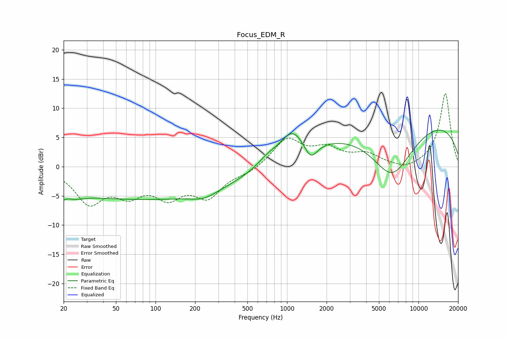

# Focus_EDM_R
See [usage instructions](https://github.com/jaakkopasanen/AutoEq#usage) for more options and info.

### Parametric EQs
Apply preamp of -6.3 dB when using parametric equalizer.

|   # | Type    |   Fc (Hz) |    Q |   Gain (dB) |
|-----|---------|-----------|------|-------------|
|   1 | Peaking |        20 | 1.92 |        -4.5 |
|   2 | Peaking |        21 | 3.07 |         2.5 |
|   3 | Peaking |        84 | 0.18 |        -5.5 |
|   4 | Peaking |       233 | 1.45 |        -1.1 |
|   5 | Peaking |       716 | 1.73 |         1.4 |
|   6 | Peaking |      1091 | 1.62 |         4.3 |
|   7 | Peaking |      1514 | 2.92 |        -2.9 |
|   8 | Peaking |      1758 | 4.3  |        -0   |
|   9 | Peaking |      6289 | 0.8  |        -9.9 |
|  10 | Peaking |      8194 | 0.18 |         9.1 |

### Fixed Band EQs
When using fixed band (also called graphic) equalizer, apply preamp of **-12.6 dB** (if available) and set gains manually with these parameters.

|   # | Type    |   Fc (Hz) |    Q |   Gain (dB) |
|-----|---------|-----------|------|-------------|
|   1 | Peaking |        31 | 1.41 |        -5.8 |
|   2 | Peaking |        62 | 1.41 |        -3.9 |
|   3 | Peaking |       125 | 1.41 |        -4.4 |
|   4 | Peaking |       250 | 1.41 |        -4.7 |
|   5 | Peaking |       500 | 1.41 |        -1   |
|   6 | Peaking |      1000 | 1.41 |         4.7 |
|   7 | Peaking |      2000 | 1.41 |         2.7 |
|   8 | Peaking |      4000 | 1.41 |         1.9 |
|   9 | Peaking |      8000 | 1.41 |        -0.8 |
|  10 | Peaking |     16000 | 1.41 |        12.6 |

### Graphs

