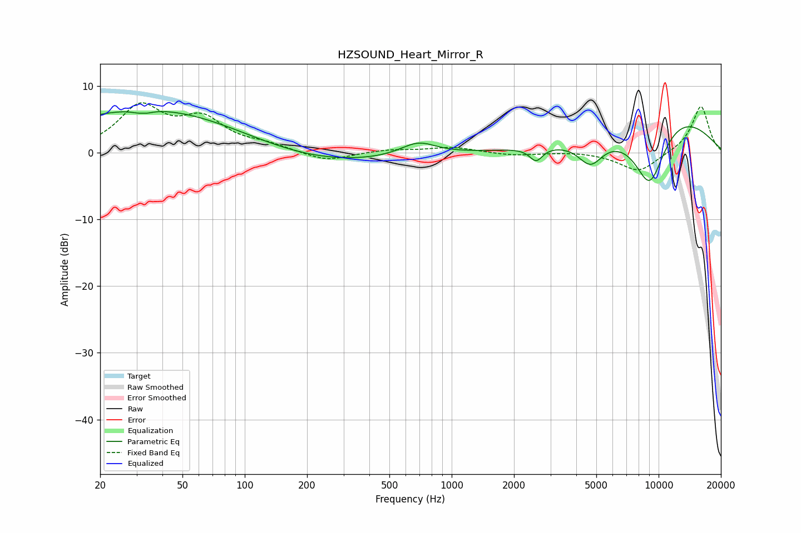

# HZSOUND_Heart_Mirror_R
See [usage instructions](https://github.com/jaakkopasanen/AutoEq#usage) for more options and info.

### Parametric EQs
Apply preamp of -6.3 dB when using parametric equalizer.

|   # | Type    |   Fc (Hz) |    Q |   Gain (dB) |
|-----|---------|-----------|------|-------------|
|   1 | Peaking |        28 | 0.26 |         0.6 |
|   2 | Peaking |        32 | 5.39 |         1.9 |
|   3 | Peaking |        32 | 4.68 |        -2.4 |
|   4 | Peaking |        36 | 0.31 |         6.1 |
|   5 | Peaking |       228 | 0.4  |        -1.9 |
|   6 | Peaking |       689 | 1.65 |         2   |
|   7 | Peaking |      2559 | 4.53 |        -2   |
|   8 | Peaking |      4686 | 2.3  |        -3.8 |
|   9 | Peaking |      9064 | 1.3  |       -13.2 |
|  10 | Peaking |     10000 | 0.47 |         9.5 |

### Fixed Band EQs
When using fixed band (also called graphic) equalizer, apply preamp of **-7.6 dB** (if available) and set gains manually with these parameters.

|   # | Type    |   Fc (Hz) |    Q |   Gain (dB) |
|-----|---------|-----------|------|-------------|
|   1 | Peaking |        31 | 1.41 |         6.6 |
|   2 | Peaking |        62 | 1.41 |         4.5 |
|   3 | Peaking |       125 | 1.41 |         1   |
|   4 | Peaking |       250 | 1.41 |        -1.4 |
|   5 | Peaking |       500 | 1.41 |         0.4 |
|   6 | Peaking |      1000 | 1.41 |         0.8 |
|   7 | Peaking |      2000 | 1.41 |        -0.4 |
|   8 | Peaking |      4000 | 1.41 |         0.2 |
|   9 | Peaking |      8000 | 1.41 |        -2.9 |
|  10 | Peaking |     16000 | 1.41 |         7.1 |

### Graphs

