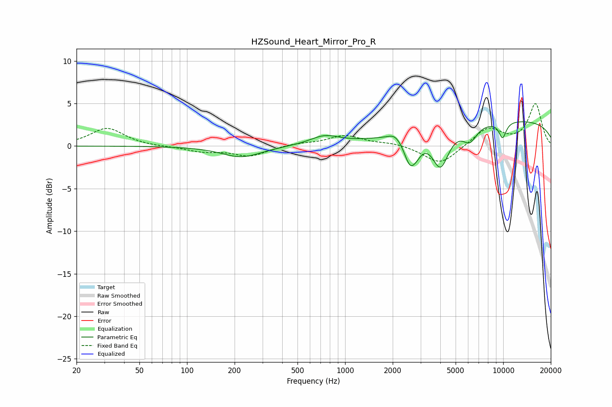

# HZSound_Heart_Mirror_Pro_R
See [usage instructions](https://github.com/jaakkopasanen/AutoEq#usage) for more options and info.

### Parametric EQs
Apply preamp of -2.9 dB when using parametric equalizer.

|   # | Type    |   Fc (Hz) |    Q |   Gain (dB) |
|-----|---------|-----------|------|-------------|
|   1 | Peaking |       221 | 1.12 |        -1.3 |
|   2 | Peaking |       742 | 1.54 |         1   |
|   3 | Peaking |      2068 | 3.42 |         0.7 |
|   4 | Peaking |      2567 | 3.77 |        -2.8 |
|   5 | Peaking |      2830 | 3.55 |        -1.2 |
|   6 | Peaking |      2956 | 6    |         0   |
|   7 | Peaking |      4011 | 2.69 |        -4.5 |
|   8 | Peaking |      6152 | 3.07 |        -1.8 |
|   9 | Peaking |      9911 | 5.19 |        -1.9 |
|  10 | Peaking |      9928 | 0.18 |         3.1 |

### Fixed Band EQs
When using fixed band (also called graphic) equalizer, apply preamp of **-5.1 dB** (if available) and set gains manually with these parameters.

|   # | Type    |   Fc (Hz) |    Q |   Gain (dB) |
|-----|---------|-----------|------|-------------|
|   1 | Peaking |        31 | 1.41 |         2.1 |
|   2 | Peaking |        62 | 1.41 |        -0.1 |
|   3 | Peaking |       125 | 1.41 |        -0.6 |
|   4 | Peaking |       250 | 1.41 |        -1.2 |
|   5 | Peaking |       500 | 1.41 |         0.3 |
|   6 | Peaking |      1000 | 1.41 |         1.2 |
|   7 | Peaking |      2000 | 1.41 |         0.3 |
|   8 | Peaking |      4000 | 1.41 |        -2.2 |
|   9 | Peaking |      8000 | 1.41 |         2.1 |
|  10 | Peaking |     16000 | 1.41 |         4.9 |

### Graphs

