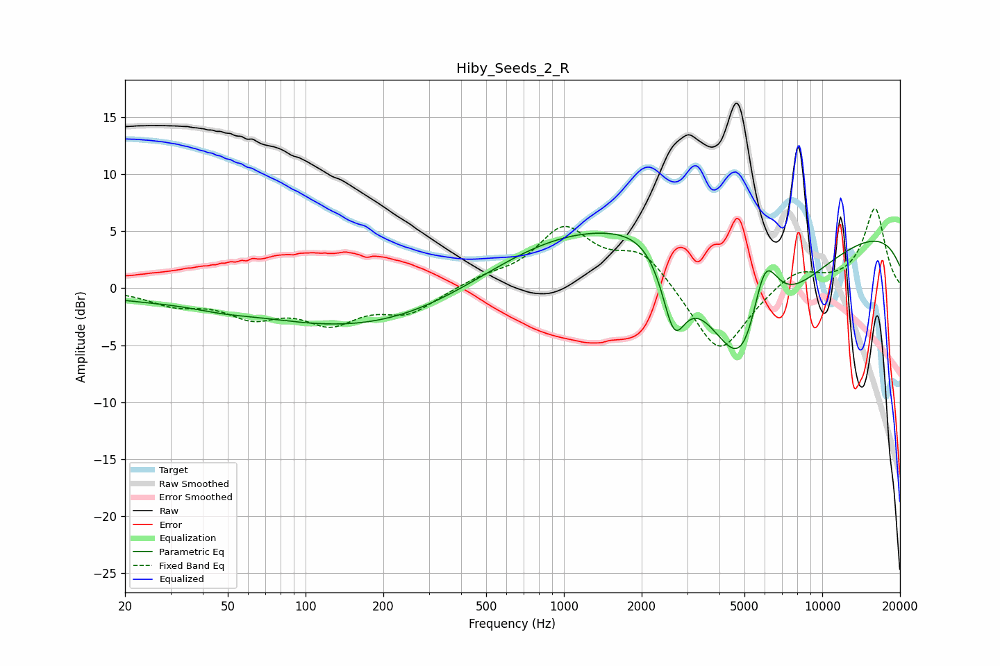

# Hiby_Seeds_2_R
See [usage instructions](https://github.com/jaakkopasanen/AutoEq#usage) for more options and info.

### Parametric EQs
Apply preamp of -4.9 dB when using parametric equalizer.

|   # | Type    |   Fc (Hz) |    Q |   Gain (dB) |
|-----|---------|-----------|------|-------------|
|   1 | Peaking |        21 | 0.65 |        -0.6 |
|   2 | Peaking |        47 | 1.18 |        -0.5 |
|   3 | Peaking |       190 | 0.31 |        -3.8 |
|   4 | Peaking |       907 | 0.38 |         2.1 |
|   5 | Peaking |      1497 | 0.32 |         3.6 |
|   6 | Peaking |      2162 | 1.14 |         1.8 |
|   7 | Peaking |      2666 | 3.05 |        -6   |
|   8 | Peaking |      5037 | 0.82 |       -16.3 |
|   9 | Peaking |      5965 | 2.32 |         8.3 |
|  10 | Peaking |     10000 | 0.18 |         5.9 |

### Fixed Band EQs
When using fixed band (also called graphic) equalizer, apply preamp of **-7.1 dB** (if available) and set gains manually with these parameters.

|   # | Type    |   Fc (Hz) |    Q |   Gain (dB) |
|-----|---------|-----------|------|-------------|
|   1 | Peaking |        31 | 1.41 |        -1.2 |
|   2 | Peaking |        62 | 1.41 |        -2.2 |
|   3 | Peaking |       125 | 1.41 |        -2.7 |
|   4 | Peaking |       250 | 1.41 |        -2   |
|   5 | Peaking |       500 | 1.41 |         0.8 |
|   6 | Peaking |      1000 | 1.41 |         5   |
|   7 | Peaking |      2000 | 1.41 |         3.1 |
|   8 | Peaking |      4000 | 1.41 |        -6.1 |
|   9 | Peaking |      8000 | 1.41 |         1.7 |
|  10 | Peaking |     16000 | 1.41 |         7   |

### Graphs

