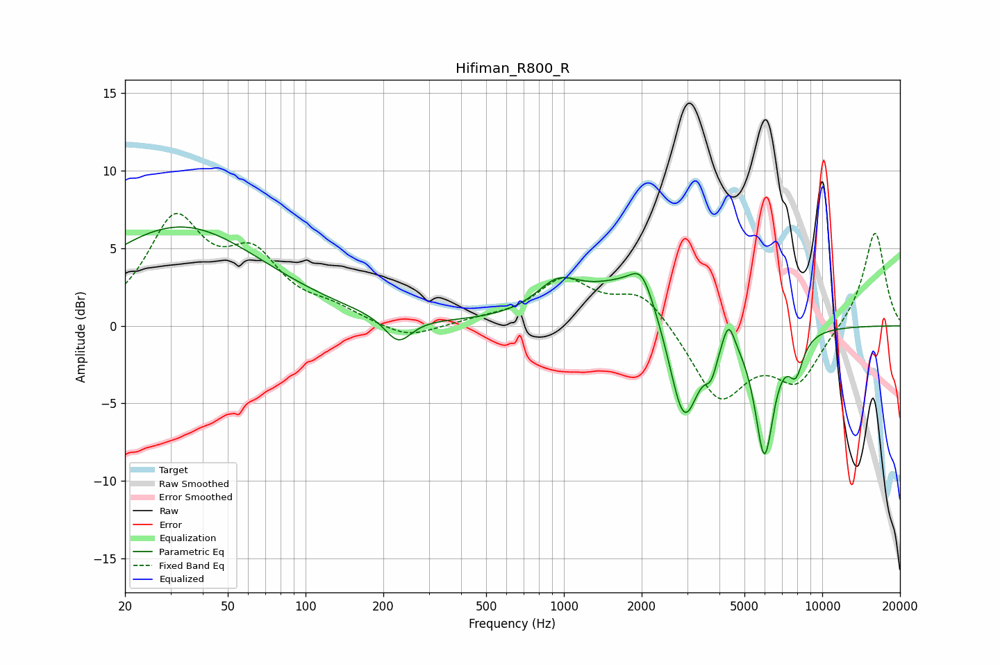

# Hifiman_R800_R
See [usage instructions](https://github.com/jaakkopasanen/AutoEq#usage) for more options and info.

### Parametric EQs
Apply preamp of -6.5 dB when using parametric equalizer.

|   # | Type    |   Fc (Hz) |    Q |   Gain (dB) |
|-----|---------|-----------|------|-------------|
|   1 | Peaking |        33 | 0.44 |         6.4 |
|   2 | Peaking |       228 | 2.75 |        -1.7 |
|   3 | Peaking |       945 | 1.71 |         1.9 |
|   4 | Peaking |      1935 | 0.77 |         3.3 |
|   5 | Peaking |      2002 | 3.31 |         1.7 |
|   6 | Peaking |      2913 | 2.27 |        -7.8 |
|   7 | Peaking |      3717 | 5.97 |        -1.5 |
|   8 | Peaking |      4336 | 6    |         1.8 |
|   9 | Peaking |      5972 | 3.72 |        -8.1 |
|  10 | Peaking |      7902 | 4.56 |        -2.2 |

### Fixed Band EQs
When using fixed band (also called graphic) equalizer, apply preamp of **-7.3 dB** (if available) and set gains manually with these parameters.

|   # | Type    |   Fc (Hz) |    Q |   Gain (dB) |
|-----|---------|-----------|------|-------------|
|   1 | Peaking |        31 | 1.41 |         6.5 |
|   2 | Peaking |        62 | 1.41 |         3.9 |
|   3 | Peaking |       125 | 1.41 |         0.8 |
|   4 | Peaking |       250 | 1.41 |        -1   |
|   5 | Peaking |       500 | 1.41 |         0.3 |
|   6 | Peaking |      1000 | 1.41 |         2.8 |
|   7 | Peaking |      2000 | 1.41 |         2.2 |
|   8 | Peaking |      4000 | 1.41 |        -4.7 |
|   9 | Peaking |      8000 | 1.41 |        -3.4 |
|  10 | Peaking |     16000 | 1.41 |         6.2 |

### Graphs

