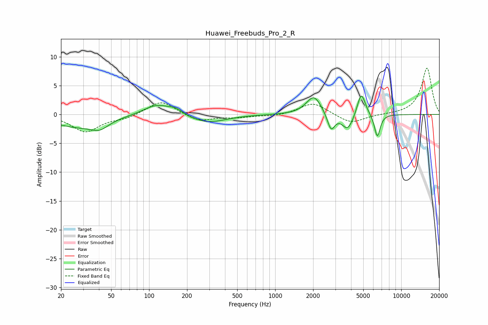

# Huawei_Freebuds_Pro_2_R
See [usage instructions](https://github.com/jaakkopasanen/AutoEq#usage) for more options and info.

### Parametric EQs
Apply preamp of -3.3 dB when using parametric equalizer.

|   # | Type    |   Fc (Hz) |    Q |   Gain (dB) |
|-----|---------|-----------|------|-------------|
|   1 | Peaking |        26 | 0.73 |        -2   |
|   2 | Peaking |        41 | 2.01 |        -1.4 |
|   3 | Peaking |       115 | 1.35 |         1.9 |
|   4 | Peaking |       163 | 2.57 |         0.8 |
|   5 | Peaking |       291 | 1.02 |        -1.5 |
|   6 | Peaking |      2028 | 2.38 |         3.3 |
|   7 | Peaking |      2774 | 4.81 |        -3   |
|   8 | Peaking |      3764 | 3.08 |        -2.8 |
|   9 | Peaking |      4819 | 4.33 |         4.2 |
|  10 | Peaking |      6458 | 6    |        -4   |

### Fixed Band EQs
When using fixed band (also called graphic) equalizer, apply preamp of **-8.1 dB** (if available) and set gains manually with these parameters.

|   # | Type    |   Fc (Hz) |    Q |   Gain (dB) |
|-----|---------|-----------|------|-------------|
|   1 | Peaking |        31 | 1.41 |        -3   |
|   2 | Peaking |        62 | 1.41 |        -0.6 |
|   3 | Peaking |       125 | 1.41 |         2.5 |
|   4 | Peaking |       250 | 1.41 |        -1.2 |
|   5 | Peaking |       500 | 1.41 |        -0.5 |
|   6 | Peaking |      1000 | 1.41 |        -0.3 |
|   7 | Peaking |      2000 | 1.41 |         2.1 |
|   8 | Peaking |      4000 | 1.41 |        -1.6 |
|   9 | Peaking |      8000 | 1.41 |         0   |
|  10 | Peaking |     16000 | 1.41 |         8.1 |

### Graphs

