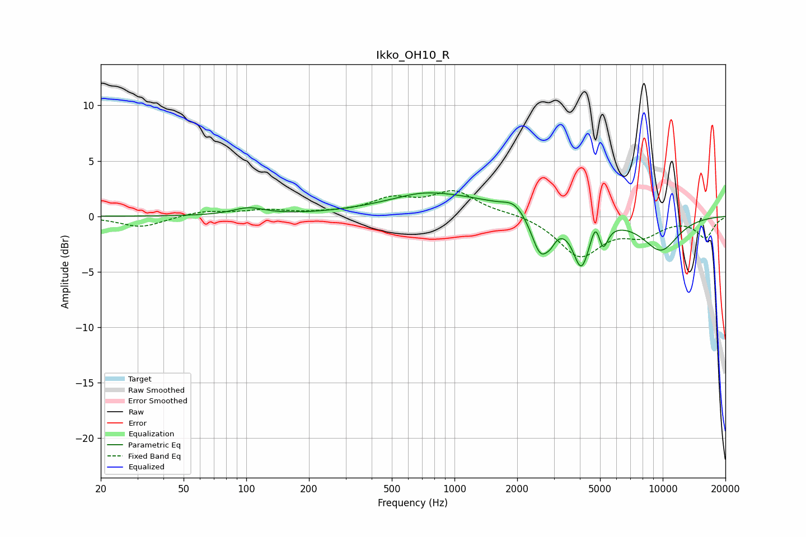

# Ikko_OH10_R
See [usage instructions](https://github.com/jaakkopasanen/AutoEq#usage) for more options and info.

### Parametric EQs
Apply preamp of -2.2 dB when using parametric equalizer.

|   # | Type    |   Fc (Hz) |    Q |   Gain (dB) |
|-----|---------|-----------|------|-------------|
|   1 | Peaking |       103 | 1.87 |         0.7 |
|   2 | Peaking |       687 | 1.22 |         0.4 |
|   3 | Peaking |       900 | 0.49 |         1.8 |
|   4 | Peaking |      1941 | 2.87 |         0.9 |
|   5 | Peaking |      2589 | 3.24 |        -3.6 |
|   6 | Peaking |      2896 | 5.99 |        -0.7 |
|   7 | Peaking |      4066 | 3.57 |        -4.4 |
|   8 | Peaking |      4771 | 5.96 |         1.7 |
|   9 | Peaking |      5162 | 6    |        -2.2 |
|  10 | Peaking |      9776 | 1.39 |        -3   |

### Fixed Band EQs
When using fixed band (also called graphic) equalizer, apply preamp of **-2.4 dB** (if available) and set gains manually with these parameters.

|   # | Type    |   Fc (Hz) |    Q |   Gain (dB) |
|-----|---------|-----------|------|-------------|
|   1 | Peaking |        31 | 1.41 |        -1   |
|   2 | Peaking |        62 | 1.41 |         0.5 |
|   3 | Peaking |       125 | 1.41 |         0.5 |
|   4 | Peaking |       250 | 1.41 |         0.2 |
|   5 | Peaking |       500 | 1.41 |         1.4 |
|   6 | Peaking |      1000 | 1.41 |         2.1 |
|   7 | Peaking |      2000 | 1.41 |         0.3 |
|   8 | Peaking |      4000 | 1.41 |        -3.5 |
|   9 | Peaking |      8000 | 1.41 |        -1.5 |
|  10 | Peaking |     16000 | 1.41 |        -1.9 |

### Graphs

