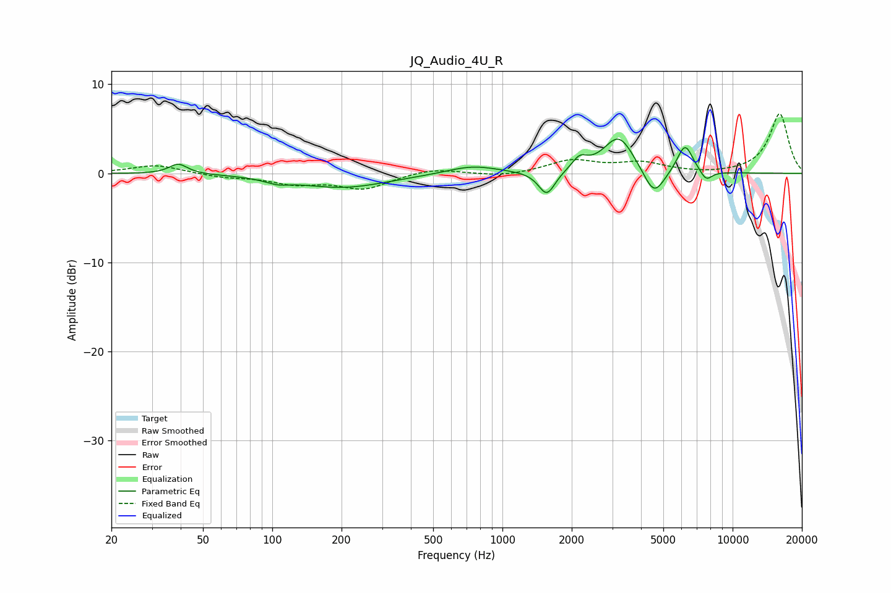

# JQ_Audio_4U_R
See [usage instructions](https://github.com/jaakkopasanen/AutoEq#usage) for more options and info.

### Parametric EQs
Apply preamp of -3.9 dB when using parametric equalizer.

|   # | Type    |   Fc (Hz) |    Q |   Gain (dB) |
|-----|---------|-----------|------|-------------|
|   1 | Peaking |        39 | 3.63 |         1.1 |
|   2 | Peaking |       105 | 2.66 |        -0.5 |
|   3 | Peaking |       202 | 0.72 |        -1.6 |
|   4 | Peaking |       740 | 1.28 |         0.9 |
|   5 | Peaking |      1559 | 3.92 |        -2.7 |
|   6 | Peaking |      2164 | 4.32 |         1.3 |
|   7 | Peaking |      3205 | 2.12 |         4.2 |
|   8 | Peaking |      4555 | 3.03 |        -3.2 |
|   9 | Peaking |      6212 | 3.96 |         3.3 |
|  10 | Peaking |      7674 | 5.06 |        -1.2 |

### Fixed Band EQs
When using fixed band (also called graphic) equalizer, apply preamp of **-6.8 dB** (if available) and set gains manually with these parameters.

|   # | Type    |   Fc (Hz) |    Q |   Gain (dB) |
|-----|---------|-----------|------|-------------|
|   1 | Peaking |        31 | 1.41 |         1   |
|   2 | Peaking |        62 | 1.41 |        -0.4 |
|   3 | Peaking |       125 | 1.41 |        -1.1 |
|   4 | Peaking |       250 | 1.41 |        -1.7 |
|   5 | Peaking |       500 | 1.41 |         0.6 |
|   6 | Peaking |      1000 | 1.41 |        -0.4 |
|   7 | Peaking |      2000 | 1.41 |         1.4 |
|   8 | Peaking |      4000 | 1.41 |         1.1 |
|   9 | Peaking |      8000 | 1.41 |        -0.1 |
|  10 | Peaking |     16000 | 1.41 |         6.7 |

### Graphs

