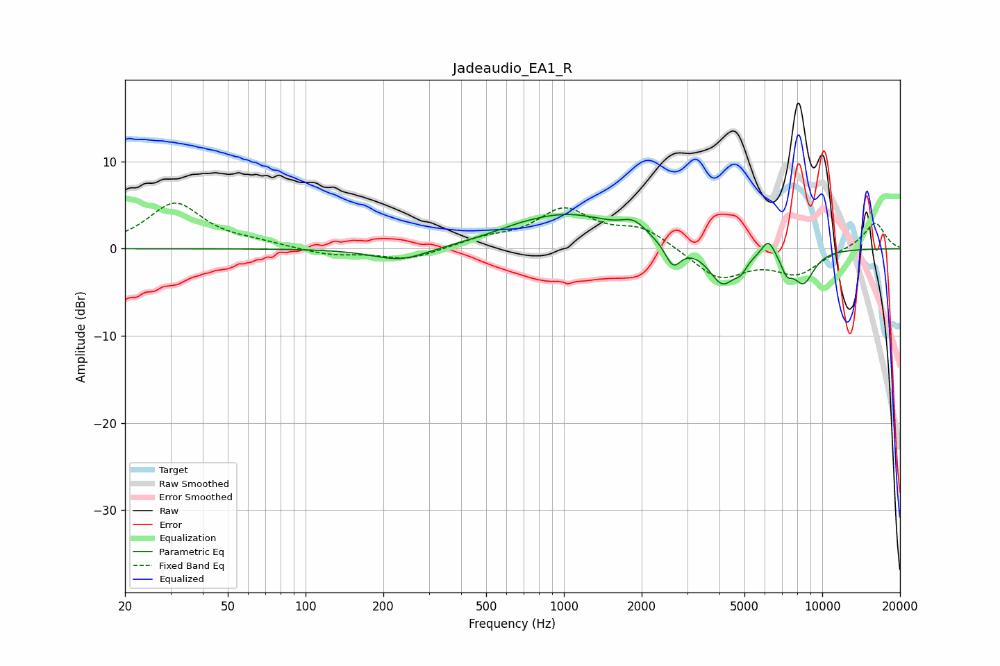

# Jadeaudio_EA1_R
See [usage instructions](https://github.com/jaakkopasanen/AutoEq#usage) for more options and info.

### Parametric EQs
Apply preamp of -4.0 dB when using parametric equalizer.

|   # | Type    |   Fc (Hz) |    Q |   Gain (dB) |
|-----|---------|-----------|------|-------------|
|   1 | Peaking |       234 | 1.29 |        -1.6 |
|   2 | Peaking |       652 | 1.71 |         0.2 |
|   3 | Peaking |      1025 | 0.69 |         3.9 |
|   4 | Peaking |      1866 | 2.99 |         1.5 |
|   5 | Peaking |      2645 | 4.59 |        -2.7 |
|   6 | Peaking |      4109 | 2.67 |        -4.2 |
|   7 | Peaking |      4842 | 6    |        -1.1 |
|   8 | Peaking |      6187 | 5.32 |         2   |
|   9 | Peaking |      7285 | 6    |        -1.8 |
|  10 | Peaking |      8453 | 3.05 |        -3.7 |

### Fixed Band EQs
When using fixed band (also called graphic) equalizer, apply preamp of **-5.3 dB** (if available) and set gains manually with these parameters.

|   # | Type    |   Fc (Hz) |    Q |   Gain (dB) |
|-----|---------|-----------|------|-------------|
|   1 | Peaking |        31 | 1.41 |         5.2 |
|   2 | Peaking |        62 | 1.41 |         0.5 |
|   3 | Peaking |       125 | 1.41 |        -0.8 |
|   4 | Peaking |       250 | 1.41 |        -1.3 |
|   5 | Peaking |       500 | 1.41 |         1   |
|   6 | Peaking |      1000 | 1.41 |         4.3 |
|   7 | Peaking |      2000 | 1.41 |         2.2 |
|   8 | Peaking |      4000 | 1.41 |        -3.4 |
|   9 | Peaking |      8000 | 1.41 |        -2.7 |
|  10 | Peaking |     16000 | 1.41 |         3.1 |

### Graphs

