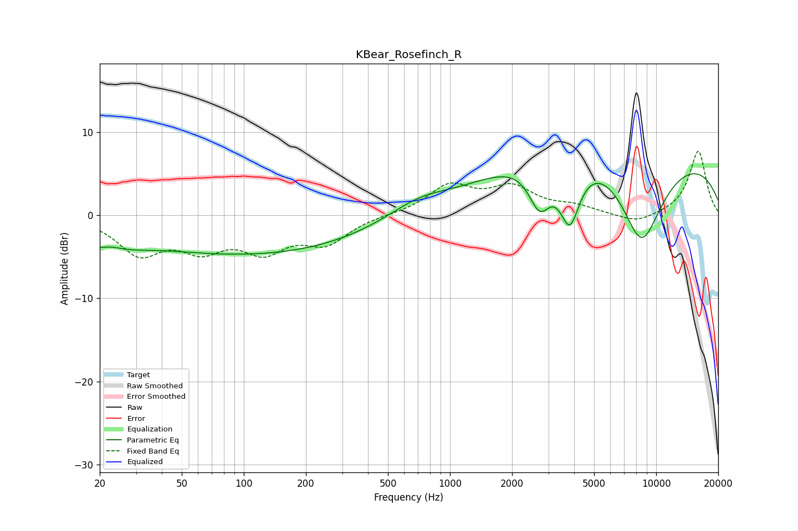

# KBear_Rosefinch_R
See [usage instructions](https://github.com/jaakkopasanen/AutoEq#usage) for more options and info.

### Parametric EQs
Apply preamp of -5.1 dB when using parametric equalizer.

|   # | Type    |   Fc (Hz) |    Q |   Gain (dB) |
|-----|---------|-----------|------|-------------|
|   1 | Peaking |        20 | 4.79 |        -0.8 |
|   2 | Peaking |        26 | 1.1  |        -1.4 |
|   3 | Peaking |       120 | 0.22 |        -4.8 |
|   4 | Peaking |       703 | 0.97 |         1.7 |
|   5 | Peaking |       966 | 0.43 |        -2.5 |
|   6 | Peaking |      1962 | 0.22 |         5   |
|   7 | Peaking |      2725 | 2.52 |        -5.5 |
|   8 | Peaking |      3813 | 2.79 |        -7.6 |
|   9 | Peaking |      8475 | 1.11 |       -12.3 |
|  10 | Peaking |      8926 | 0.2  |         7.7 |

### Fixed Band EQs
When using fixed band (also called graphic) equalizer, apply preamp of **-7.8 dB** (if available) and set gains manually with these parameters.

|   # | Type    |   Fc (Hz) |    Q |   Gain (dB) |
|-----|---------|-----------|------|-------------|
|   1 | Peaking |        31 | 1.41 |        -4.3 |
|   2 | Peaking |        62 | 1.41 |        -3.4 |
|   3 | Peaking |       125 | 1.41 |        -3.7 |
|   4 | Peaking |       250 | 1.41 |        -3.1 |
|   5 | Peaking |       500 | 1.41 |         0.1 |
|   6 | Peaking |      1000 | 1.41 |         3.4 |
|   7 | Peaking |      2000 | 1.41 |         3.1 |
|   8 | Peaking |      4000 | 1.41 |         0.9 |
|   9 | Peaking |      8000 | 1.41 |        -1.1 |
|  10 | Peaking |     16000 | 1.41 |         7.8 |

### Graphs

