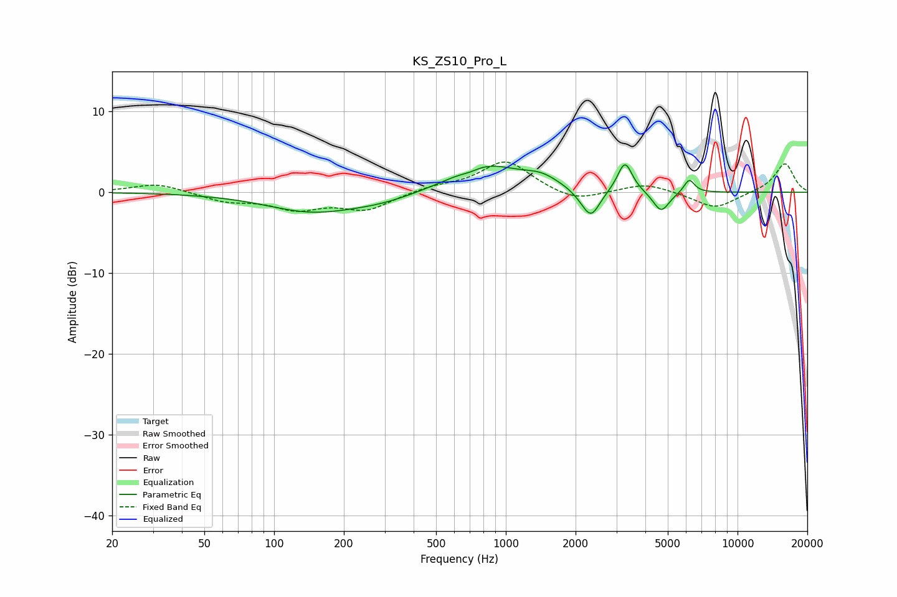

# KS_ZS10_Pro_L
See [usage instructions](https://github.com/jaakkopasanen/AutoEq#usage) for more options and info.

### Parametric EQs
Apply preamp of -3.5 dB when using parametric equalizer.

|   # | Type    |   Fc (Hz) |    Q |   Gain (dB) |
|-----|---------|-----------|------|-------------|
|   1 | Peaking |       145 | 0.72 |        -2.3 |
|   2 | Peaking |       292 | 0.87 |        -0.9 |
|   3 | Peaking |       698 | 3.59 |        -0.4 |
|   4 | Peaking |       815 | 0.93 |         3.4 |
|   5 | Peaking |      1427 | 1.87 |         1.2 |
|   6 | Peaking |      2185 | 2.87 |        -0.8 |
|   7 | Peaking |      2338 | 3.75 |        -3   |
|   8 | Peaking |      3267 | 4.47 |         3.8 |
|   9 | Peaking |      4682 | 3.99 |        -2.6 |
|  10 | Peaking |      6187 | 6    |         1.7 |

### Fixed Band EQs
When using fixed band (also called graphic) equalizer, apply preamp of **-3.8 dB** (if available) and set gains manually with these parameters.

|   # | Type    |   Fc (Hz) |    Q |   Gain (dB) |
|-----|---------|-----------|------|-------------|
|   1 | Peaking |        31 | 1.41 |         1.1 |
|   2 | Peaking |        62 | 1.41 |        -1.1 |
|   3 | Peaking |       125 | 1.41 |        -1.9 |
|   4 | Peaking |       250 | 1.41 |        -2.1 |
|   5 | Peaking |       500 | 1.41 |         0.6 |
|   6 | Peaking |      1000 | 1.41 |         3.9 |
|   7 | Peaking |      2000 | 1.41 |        -1.3 |
|   8 | Peaking |      4000 | 1.41 |         1.1 |
|   9 | Peaking |      8000 | 1.41 |        -2.1 |
|  10 | Peaking |     16000 | 1.41 |         3.6 |

### Graphs

