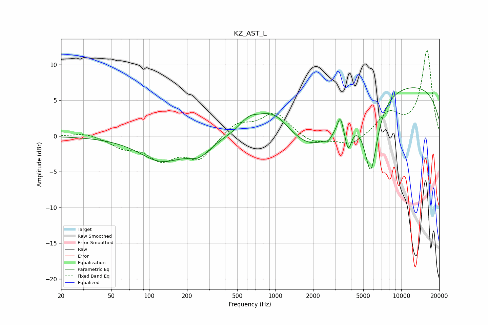

# KZ_AST_L
See [usage instructions](https://github.com/jaakkopasanen/AutoEq#usage) for more options and info.

### Parametric EQs
Apply preamp of -6.9 dB when using parametric equalizer.

|   # | Type    |   Fc (Hz) |    Q |   Gain (dB) |
|-----|---------|-----------|------|-------------|
|   1 | Peaking |       125 | 0.81 |        -3.3 |
|   2 | Peaking |       250 | 1.54 |        -1.9 |
|   3 | Peaking |       619 | 1.89 |         1.5 |
|   4 | Peaking |       970 | 0.98 |         4.2 |
|   5 | Peaking |      2035 | 0.6  |        -5.6 |
|   6 | Peaking |      2643 | 5.76 |        -0.6 |
|   7 | Peaking |      3285 | 5.98 |         2.4 |
|   8 | Peaking |      3798 | 5.17 |        -3.5 |
|   9 | Peaking |      5734 | 2.63 |       -10   |
|  10 | Peaking |      9407 | 0.19 |         7.5 |

### Fixed Band EQs
When using fixed band (also called graphic) equalizer, apply preamp of **-12.1 dB** (if available) and set gains manually with these parameters.

|   # | Type    |   Fc (Hz) |    Q |   Gain (dB) |
|-----|---------|-----------|------|-------------|
|   1 | Peaking |        31 | 1.41 |         0.5 |
|   2 | Peaking |        62 | 1.41 |        -1.4 |
|   3 | Peaking |       125 | 1.41 |        -3   |
|   4 | Peaking |       250 | 1.41 |        -3.1 |
|   5 | Peaking |       500 | 1.41 |         1.9 |
|   6 | Peaking |      1000 | 1.41 |         3.2 |
|   7 | Peaking |      2000 | 1.41 |        -1.1 |
|   8 | Peaking |      4000 | 1.41 |        -1.4 |
|   9 | Peaking |      8000 | 1.41 |         3   |
|  10 | Peaking |     16000 | 1.41 |        12   |

### Graphs

