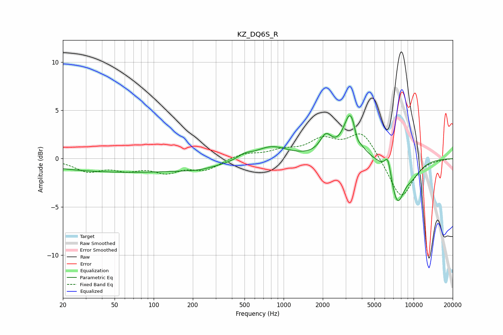

# KZ_DQ6S_R
See [usage instructions](https://github.com/jaakkopasanen/AutoEq#usage) for more options and info.

### Parametric EQs
Apply preamp of -4.6 dB when using parametric equalizer.

|   # | Type    |   Fc (Hz) |    Q |   Gain (dB) |
|-----|---------|-----------|------|-------------|
|   1 | Peaking |        68 | 0.19 |        -1.4 |
|   2 | Peaking |       224 | 1.44 |        -0.2 |
|   3 | Peaking |       499 | 2.76 |         0.5 |
|   4 | Peaking |       800 | 1.12 |         1.4 |
|   5 | Peaking |      2113 | 3.13 |         1.9 |
|   6 | Peaking |      3273 | 2.76 |         4.7 |
|   7 | Peaking |      3669 | 6    |        -0.9 |
|   8 | Peaking |      6343 | 5.63 |         1.9 |
|   9 | Peaking |      7494 | 2.52 |        -4.2 |
|  10 | Peaking |      9701 | 1.65 |        -1.4 |

### Fixed Band EQs
When using fixed band (also called graphic) equalizer, apply preamp of **-2.7 dB** (if available) and set gains manually with these parameters.

|   # | Type    |   Fc (Hz) |    Q |   Gain (dB) |
|-----|---------|-----------|------|-------------|
|   1 | Peaking |        31 | 1.41 |        -1.2 |
|   2 | Peaking |        62 | 1.41 |        -0.9 |
|   3 | Peaking |       125 | 1.41 |        -1.2 |
|   4 | Peaking |       250 | 1.41 |        -1.1 |
|   5 | Peaking |       500 | 1.41 |         0.5 |
|   6 | Peaking |      1000 | 1.41 |         0.7 |
|   7 | Peaking |      2000 | 1.41 |         1.8 |
|   8 | Peaking |      4000 | 1.41 |         2.8 |
|   9 | Peaking |      8000 | 1.41 |        -4.2 |
|  10 | Peaking |     16000 | 1.41 |        -0.1 |

### Graphs

