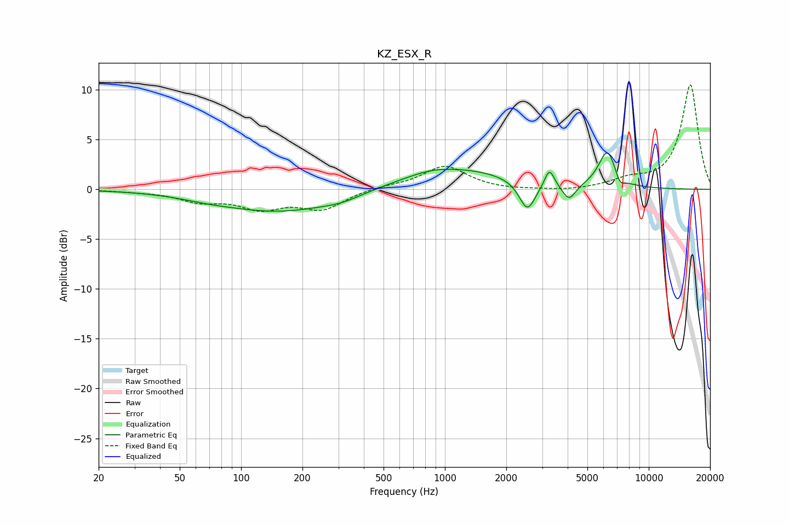

# KZ_ESX_R
See [usage instructions](https://github.com/jaakkopasanen/AutoEq#usage) for more options and info.

### Parametric EQs
Apply preamp of -3.8 dB when using parametric equalizer.

|   # | Type    |   Fc (Hz) |    Q |   Gain (dB) |
|-----|---------|-----------|------|-------------|
|   1 | Peaking |        67 | 1.19 |        -0.2 |
|   2 | Peaking |       156 | 0.47 |        -2.2 |
|   3 | Peaking |       314 | 1.52 |        -0.4 |
|   4 | Peaking |       850 | 1.53 |         0.3 |
|   5 | Peaking |      1107 | 0.51 |         2.1 |
|   6 | Peaking |      2538 | 3.53 |        -3   |
|   7 | Peaking |      3258 | 6    |         1.9 |
|   8 | Peaking |      4065 | 4.27 |        -1.6 |
|   9 | Peaking |      6262 | 3.21 |         3.8 |
|  10 | Peaking |      7222 | 6    |        -1   |

### Fixed Band EQs
When using fixed band (also called graphic) equalizer, apply preamp of **-10.6 dB** (if available) and set gains manually with these parameters.

|   # | Type    |   Fc (Hz) |    Q |   Gain (dB) |
|-----|---------|-----------|------|-------------|
|   1 | Peaking |        31 | 1.41 |        -0.1 |
|   2 | Peaking |        62 | 1.41 |        -1.1 |
|   3 | Peaking |       125 | 1.41 |        -1.7 |
|   4 | Peaking |       250 | 1.41 |        -1.9 |
|   5 | Peaking |       500 | 1.41 |         0.3 |
|   6 | Peaking |      1000 | 1.41 |         2.3 |
|   7 | Peaking |      2000 | 1.41 |        -0.1 |
|   8 | Peaking |      4000 | 1.41 |        -0.2 |
|   9 | Peaking |      8000 | 1.41 |         0.8 |
|  10 | Peaking |     16000 | 1.41 |        10.5 |

### Graphs

