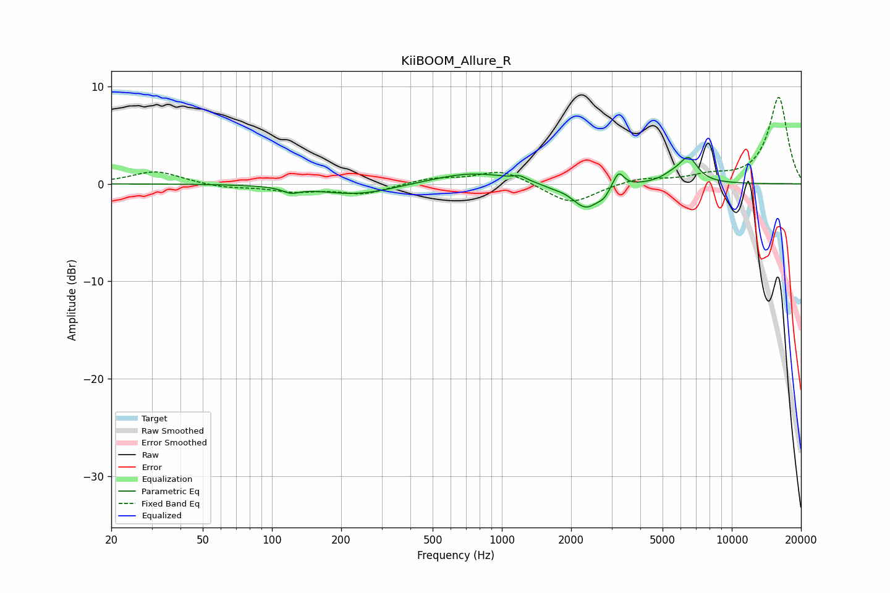

# KiiBOOM_Allure_R
See [usage instructions](https://github.com/jaakkopasanen/AutoEq#usage) for more options and info.

### Parametric EQs
Apply preamp of -2.8 dB when using parametric equalizer.

|   # | Type    |   Fc (Hz) |    Q |   Gain (dB) |
|-----|---------|-----------|------|-------------|
|   1 | Peaking |       121 | 3.91 |        -0.6 |
|   2 | Peaking |       233 | 0.86 |        -1.1 |
|   3 | Peaking |       741 | 0.82 |         1.2 |
|   4 | Peaking |      1197 | 5.36 |         0.4 |
|   5 | Peaking |      1636 | 3.34 |        -0.2 |
|   6 | Peaking |      2322 | 2.32 |        -2.6 |
|   7 | Peaking |      2775 | 6    |        -0.6 |
|   8 | Peaking |      3216 | 6    |         1.7 |
|   9 | Peaking |      5470 | 3.01 |         0.6 |
|  10 | Peaking |      6476 | 3.37 |         2.5 |

### Fixed Band EQs
When using fixed band (also called graphic) equalizer, apply preamp of **-9.0 dB** (if available) and set gains manually with these parameters.

|   # | Type    |   Fc (Hz) |    Q |   Gain (dB) |
|-----|---------|-----------|------|-------------|
|   1 | Peaking |        31 | 1.41 |         1.3 |
|   2 | Peaking |        62 | 1.41 |        -0.4 |
|   3 | Peaking |       125 | 1.41 |        -0.7 |
|   4 | Peaking |       250 | 1.41 |        -1   |
|   5 | Peaking |       500 | 1.41 |         0.6 |
|   6 | Peaking |      1000 | 1.41 |         1.4 |
|   7 | Peaking |      2000 | 1.41 |        -2.1 |
|   8 | Peaking |      4000 | 1.41 |         0.6 |
|   9 | Peaking |      8000 | 1.41 |         0.7 |
|  10 | Peaking |     16000 | 1.41 |         8.9 |

### Graphs

