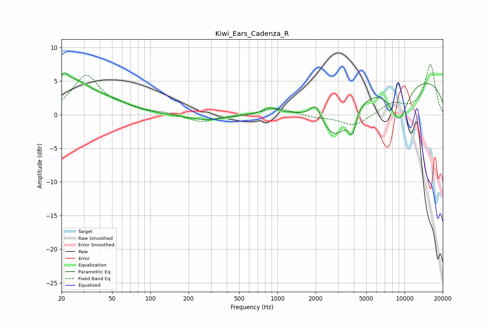

# Kiwi_Ears_Cadenza_R
See [usage instructions](https://github.com/jaakkopasanen/AutoEq#usage) for more options and info.

### Parametric EQs
Apply preamp of -6.3 dB when using parametric equalizer.

|   # | Type    |   Fc (Hz) |    Q |   Gain (dB) |
|-----|---------|-----------|------|-------------|
|   1 | Peaking |        21 | 5.36 |         1.5 |
|   2 | Peaking |        24 | 0.93 |         4.7 |
|   3 | Peaking |        49 | 0.96 |         1.2 |
|   4 | Peaking |       273 | 0.86 |        -0.8 |
|   5 | Peaking |       875 | 2.65 |         0.9 |
|   6 | Peaking |      2009 | 3.33 |         2.4 |
|   7 | Peaking |      2842 | 1.13 |        -6.3 |
|   8 | Peaking |      3881 | 5.3  |        -3.1 |
|   9 | Peaking |      9063 | 1.72 |        -5.8 |
|  10 | Peaking |     10000 | 0.19 |         5.7 |

### Fixed Band EQs
When using fixed band (also called graphic) equalizer, apply preamp of **-7.6 dB** (if available) and set gains manually with these parameters.

|   # | Type    |   Fc (Hz) |    Q |   Gain (dB) |
|-----|---------|-----------|------|-------------|
|   1 | Peaking |        31 | 1.41 |         5.7 |
|   2 | Peaking |        62 | 1.41 |         0.7 |
|   3 | Peaking |       125 | 1.41 |         0.3 |
|   4 | Peaking |       250 | 1.41 |        -1.1 |
|   5 | Peaking |       500 | 1.41 |        -0.1 |
|   6 | Peaking |      1000 | 1.41 |         1.1 |
|   7 | Peaking |      2000 | 1.41 |        -0.4 |
|   8 | Peaking |      4000 | 1.41 |        -1.7 |
|   9 | Peaking |      8000 | 1.41 |         1.7 |
|  10 | Peaking |     16000 | 1.41 |         7.5 |

### Graphs

