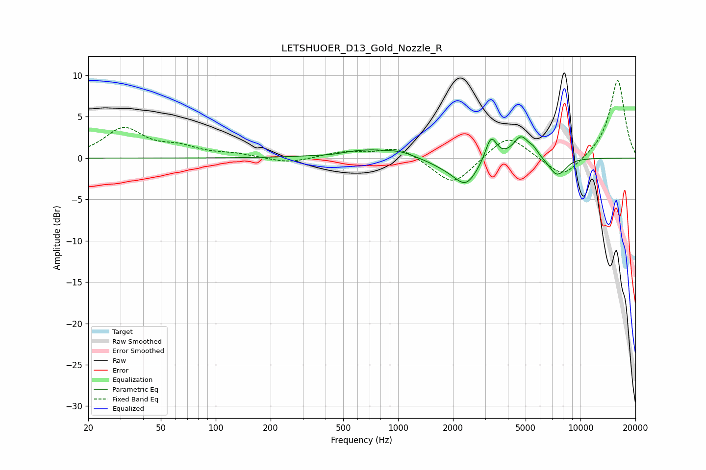

# LETSHUOER_D13_Gold_Nozzle_R
See [usage instructions](https://github.com/jaakkopasanen/AutoEq#usage) for more options and info.

### Parametric EQs
Apply preamp of -2.7 dB when using parametric equalizer.

|   # | Type    |   Fc (Hz) |    Q |   Gain (dB) |
|-----|---------|-----------|------|-------------|
|   1 | Peaking |       435 | 1.75 |        -0.2 |
|   2 | Peaking |       682 | 0.81 |         1.1 |
|   3 | Peaking |      1043 | 2.16 |         0.4 |
|   4 | Peaking |      1839 | 1.48 |        -0.8 |
|   5 | Peaking |      2358 | 2.2  |        -3   |
|   6 | Peaking |      3232 | 4.59 |         3   |
|   7 | Peaking |      4722 | 3.2  |         2.6 |
|   8 | Peaking |      5532 | 5.39 |         0.7 |
|   9 | Peaking |      7361 | 3.22 |        -2   |
|  10 | Peaking |      8119 | 4.56 |        -0.4 |

### Fixed Band EQs
When using fixed band (also called graphic) equalizer, apply preamp of **-9.5 dB** (if available) and set gains manually with these parameters.

|   # | Type    |   Fc (Hz) |    Q |   Gain (dB) |
|-----|---------|-----------|------|-------------|
|   1 | Peaking |        31 | 1.41 |         3.5 |
|   2 | Peaking |        62 | 1.41 |         1.1 |
|   3 | Peaking |       125 | 1.41 |         0.4 |
|   4 | Peaking |       250 | 1.41 |        -0.7 |
|   5 | Peaking |       500 | 1.41 |         0.7 |
|   6 | Peaking |      1000 | 1.41 |         1.4 |
|   7 | Peaking |      2000 | 1.41 |        -3.4 |
|   8 | Peaking |      4000 | 1.41 |         3   |
|   9 | Peaking |      8000 | 1.41 |        -2.6 |
|  10 | Peaking |     16000 | 1.41 |         9.5 |

### Graphs

