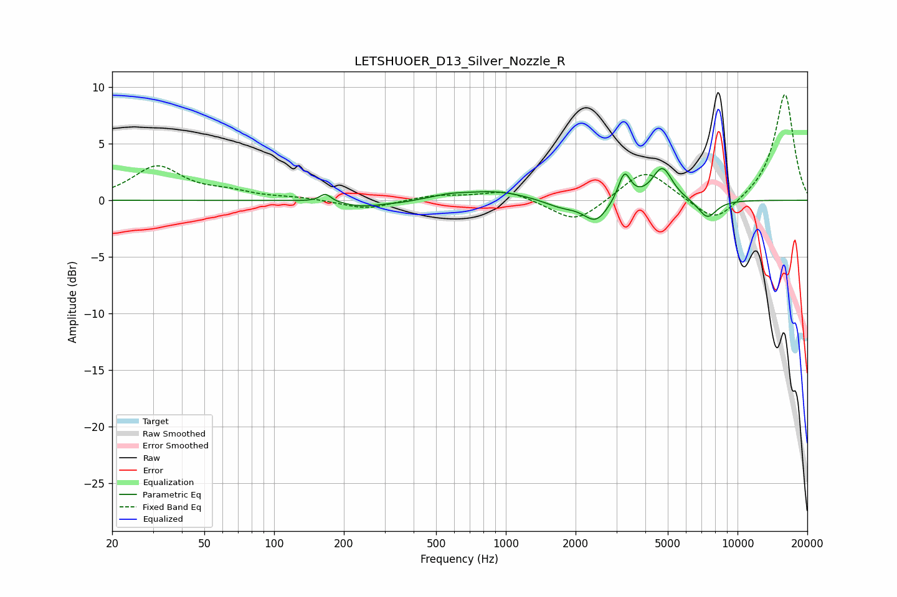

# LETSHUOER_D13_Silver_Nozzle_R
See [usage instructions](https://github.com/jaakkopasanen/AutoEq#usage) for more options and info.

### Parametric EQs
Apply preamp of -2.9 dB when using parametric equalizer.

|   # | Type    |   Fc (Hz) |    Q |   Gain (dB) |
|-----|---------|-----------|------|-------------|
|   1 | Peaking |       167 | 6    |         0.7 |
|   2 | Peaking |       241 | 1.64 |        -0.5 |
|   3 | Peaking |       353 | 1.91 |        -0.2 |
|   4 | Peaking |       569 | 1.94 |         0.3 |
|   5 | Peaking |       901 | 1    |         0.8 |
|   6 | Peaking |      1725 | 1.91 |        -0.6 |
|   7 | Peaking |      2446 | 2.66 |        -1.9 |
|   8 | Peaking |      3248 | 5.32 |         2.5 |
|   9 | Peaking |      4737 | 3.21 |         2.9 |
|  10 | Peaking |      7406 | 3.27 |        -1.6 |

### Fixed Band EQs
When using fixed band (also called graphic) equalizer, apply preamp of **-9.4 dB** (if available) and set gains manually with these parameters.

|   # | Type    |   Fc (Hz) |    Q |   Gain (dB) |
|-----|---------|-----------|------|-------------|
|   1 | Peaking |        31 | 1.41 |         2.9 |
|   2 | Peaking |        62 | 1.41 |         0.6 |
|   3 | Peaking |       125 | 1.41 |         0.2 |
|   4 | Peaking |       250 | 1.41 |        -0.8 |
|   5 | Peaking |       500 | 1.41 |         0.4 |
|   6 | Peaking |      1000 | 1.41 |         0.9 |
|   7 | Peaking |      2000 | 1.41 |        -2.1 |
|   8 | Peaking |      4000 | 1.41 |         2.8 |
|   9 | Peaking |      8000 | 1.41 |        -2.2 |
|  10 | Peaking |     16000 | 1.41 |         9.5 |

### Graphs

