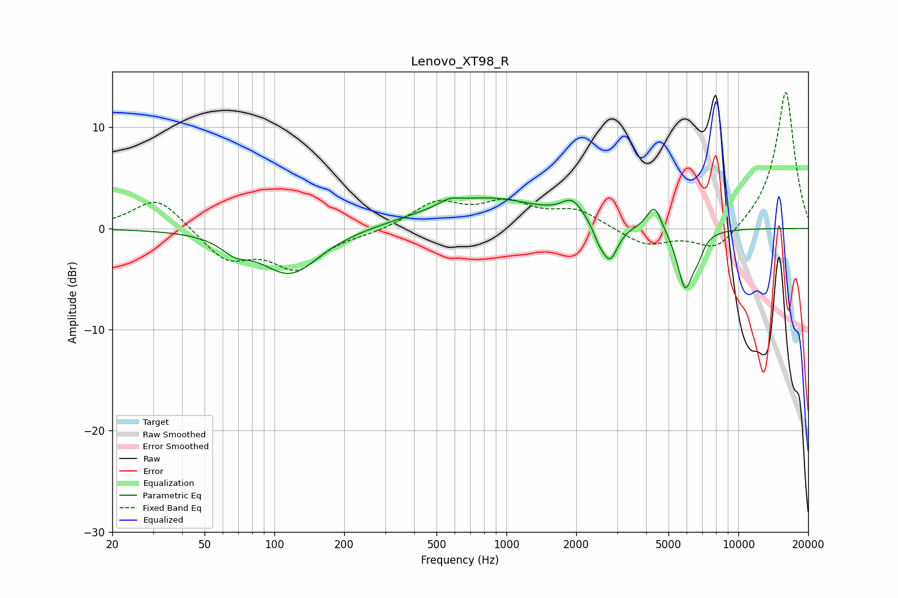

# Lenovo_XT98_R
See [usage instructions](https://github.com/jaakkopasanen/AutoEq#usage) for more options and info.

### Parametric EQs
Apply preamp of -3.1 dB when using parametric equalizer.

|   # | Type    |   Fc (Hz) |    Q |   Gain (dB) |
|-----|---------|-----------|------|-------------|
|   1 | Peaking |        68 | 2.39 |        -1.2 |
|   2 | Peaking |       117 | 1.11 |        -4.5 |
|   3 | Peaking |       567 | 3.48 |         0.5 |
|   4 | Peaking |       808 | 0.56 |         3   |
|   5 | Peaking |      1926 | 2.99 |         1.8 |
|   6 | Peaking |      2507 | 5.64 |        -1.1 |
|   7 | Peaking |      2797 | 4.08 |        -3.6 |
|   8 | Peaking |      4344 | 4.48 |         2.5 |
|   9 | Peaking |      5899 | 4.02 |        -5.9 |
|  10 | Peaking |      6697 | 5.73 |        -1.2 |

### Fixed Band EQs
When using fixed band (also called graphic) equalizer, apply preamp of **-13.6 dB** (if available) and set gains manually with these parameters.

|   # | Type    |   Fc (Hz) |    Q |   Gain (dB) |
|-----|---------|-----------|------|-------------|
|   1 | Peaking |        31 | 1.41 |         3.2 |
|   2 | Peaking |        62 | 1.41 |        -3   |
|   3 | Peaking |       125 | 1.41 |        -3.7 |
|   4 | Peaking |       250 | 1.41 |        -0.4 |
|   5 | Peaking |       500 | 1.41 |         2.5 |
|   6 | Peaking |      1000 | 1.41 |         2.3 |
|   7 | Peaking |      2000 | 1.41 |         1.7 |
|   8 | Peaking |      4000 | 1.41 |        -1.7 |
|   9 | Peaking |      8000 | 1.41 |        -2.4 |
|  10 | Peaking |     16000 | 1.41 |        13.7 |

### Graphs

