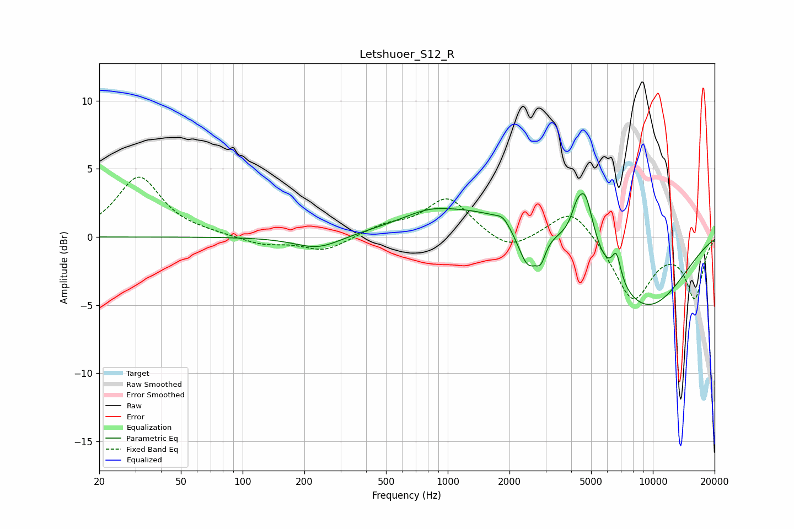

# Letshuoer_S12_R
See [usage instructions](https://github.com/jaakkopasanen/AutoEq#usage) for more options and info.

### Parametric EQs
Apply preamp of -3.3 dB when using parametric equalizer.

|   # | Type    |   Fc (Hz) |    Q |   Gain (dB) |
|-----|---------|-----------|------|-------------|
|   1 | Peaking |       233 | 1.23 |        -1   |
|   2 | Peaking |       805 | 1.24 |         0.6 |
|   3 | Peaking |      1680 | 0.37 |         2.2 |
|   4 | Peaking |      1858 | 4.65 |         0.5 |
|   5 | Peaking |      2459 | 2.77 |        -3.2 |
|   6 | Peaking |      2844 | 6    |        -1.3 |
|   7 | Peaking |      4218 | 5.99 |         0.8 |
|   8 | Peaking |      4655 | 3.25 |         4.5 |
|   9 | Peaking |      6646 | 6    |         2   |
|  10 | Peaking |      9049 | 0.58 |        -5.5 |

### Fixed Band EQs
When using fixed band (also called graphic) equalizer, apply preamp of **-4.5 dB** (if available) and set gains manually with these parameters.

|   # | Type    |   Fc (Hz) |    Q |   Gain (dB) |
|-----|---------|-----------|------|-------------|
|   1 | Peaking |        31 | 1.41 |         4.4 |
|   2 | Peaking |        62 | 1.41 |         0.2 |
|   3 | Peaking |       125 | 1.41 |        -0.6 |
|   4 | Peaking |       250 | 1.41 |        -1.1 |
|   5 | Peaking |       500 | 1.41 |         0.7 |
|   6 | Peaking |      1000 | 1.41 |         2.9 |
|   7 | Peaking |      2000 | 1.41 |        -1.2 |
|   8 | Peaking |      4000 | 1.41 |         2.3 |
|   9 | Peaking |      8000 | 1.41 |        -4.6 |
|  10 | Peaking |     16000 | 1.41 |        -4.3 |

### Graphs

