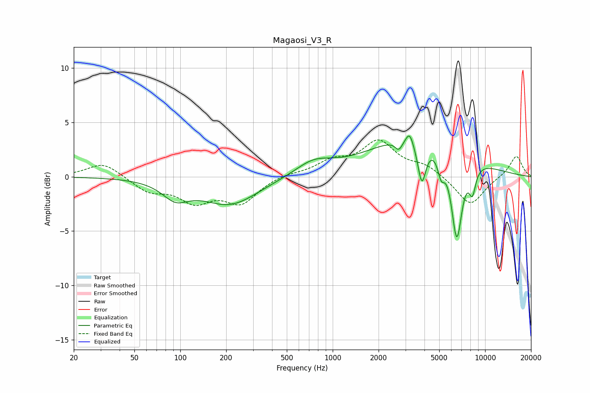

# Magaosi_V3_R
See [usage instructions](https://github.com/jaakkopasanen/AutoEq#usage) for more options and info.

### Parametric EQs
Apply preamp of -3.9 dB when using parametric equalizer.

|   # | Type    |   Fc (Hz) |    Q |   Gain (dB) |
|-----|---------|-----------|------|-------------|
|   1 | Peaking |        93 | 1.67 |        -1.5 |
|   2 | Peaking |       212 | 0.76 |        -2.5 |
|   3 | Peaking |       749 | 1.19 |         1.3 |
|   4 | Peaking |      2716 | 6    |        -0.9 |
|   5 | Peaking |      3195 | 5.98 |         1.1 |
|   6 | Peaking |      3680 | 0.45 |         3.8 |
|   7 | Peaking |      3845 | 5.2  |        -3.8 |
|   8 | Peaking |      5148 | 5.99 |        -1.8 |
|   9 | Peaking |      6515 | 3.75 |        -7.9 |
|  10 | Peaking |      8251 | 5.76 |        -2.3 |

### Fixed Band EQs
When using fixed band (also called graphic) equalizer, apply preamp of **-3.5 dB** (if available) and set gains manually with these parameters.

|   # | Type    |   Fc (Hz) |    Q |   Gain (dB) |
|-----|---------|-----------|------|-------------|
|   1 | Peaking |        31 | 1.41 |         1.3 |
|   2 | Peaking |        62 | 1.41 |        -1.3 |
|   3 | Peaking |       125 | 1.41 |        -2.1 |
|   4 | Peaking |       250 | 1.41 |        -2.3 |
|   5 | Peaking |       500 | 1.41 |         0.3 |
|   6 | Peaking |      1000 | 1.41 |         1.3 |
|   7 | Peaking |      2000 | 1.41 |         3.1 |
|   8 | Peaking |      4000 | 1.41 |         0.9 |
|   9 | Peaking |      8000 | 1.41 |        -2.7 |
|  10 | Peaking |     16000 | 1.41 |         2   |

### Graphs

