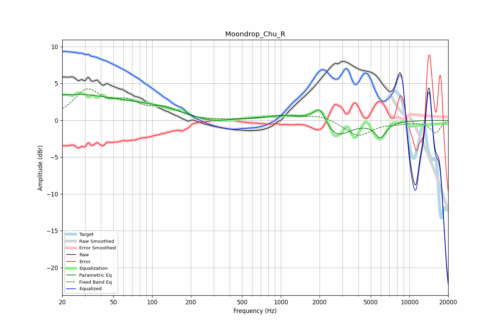

# Moondrop_Chu_R
See [usage instructions](https://github.com/jaakkopasanen/AutoEq#usage) for more options and info.

### Parametric EQs
Apply preamp of -3.6 dB when using parametric equalizer.

|   # | Type    |   Fc (Hz) |    Q |   Gain (dB) |
|-----|---------|-----------|------|-------------|
|   1 | Peaking |        20 | 4.95 |         0.4 |
|   2 | Peaking |        24 | 0.61 |         2.8 |
|   3 | Peaking |        59 | 0.6  |         1.3 |
|   4 | Peaking |        66 | 1.18 |        -0   |
|   5 | Peaking |       120 | 0.68 |         1   |
|   6 | Peaking |       284 | 1.25 |        -0.6 |
|   7 | Peaking |      1244 | 0.71 |         0.8 |
|   8 | Peaking |      2012 | 2.88 |         2.6 |
|   9 | Peaking |      2633 | 1.26 |        -2.7 |
|  10 | Peaking |      5952 | 3.14 |        -2.1 |

### Fixed Band EQs
When using fixed band (also called graphic) equalizer, apply preamp of **-4.4 dB** (if available) and set gains manually with these parameters.

|   # | Type    |   Fc (Hz) |    Q |   Gain (dB) |
|-----|---------|-----------|------|-------------|
|   1 | Peaking |        31 | 1.41 |         3.8 |
|   2 | Peaking |        62 | 1.41 |         2.1 |
|   3 | Peaking |       125 | 1.41 |         1.5 |
|   4 | Peaking |       250 | 1.41 |        -0   |
|   5 | Peaking |       500 | 1.41 |         0   |
|   6 | Peaking |      1000 | 1.41 |         0.6 |
|   7 | Peaking |      2000 | 1.41 |         0.7 |
|   8 | Peaking |      4000 | 1.41 |        -2.1 |
|   9 | Peaking |      8000 | 1.41 |        -0.3 |
|  10 | Peaking |     16000 | 1.41 |        -1.7 |

### Graphs

