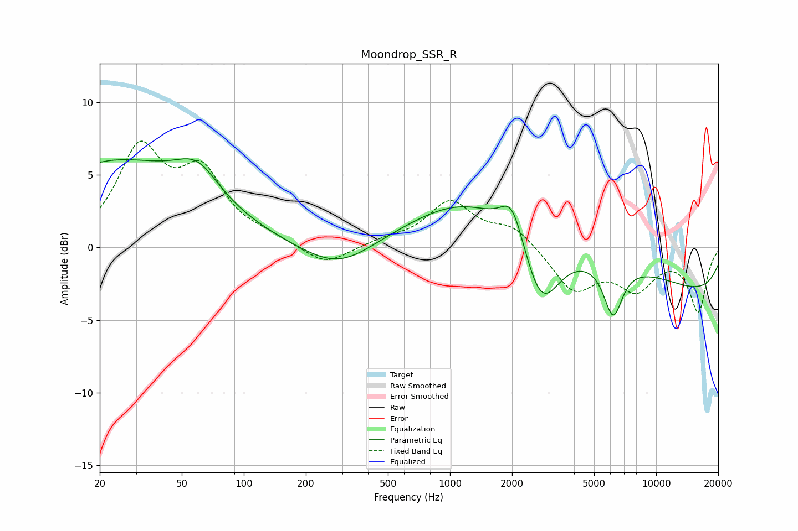

# Moondrop_SSR_R
See [usage instructions](https://github.com/jaakkopasanen/AutoEq#usage) for more options and info.

### Parametric EQs
Apply preamp of -6.2 dB when using parametric equalizer.

|   # | Type    |   Fc (Hz) |    Q |   Gain (dB) |
|-----|---------|-----------|------|-------------|
|   1 | Peaking |        20 | 5.91 |        -0   |
|   2 | Peaking |        23 | 0.32 |         5.8 |
|   3 | Peaking |        60 | 1.38 |         2.2 |
|   4 | Peaking |       288 | 0.81 |        -1.9 |
|   5 | Peaking |      1167 | 0.69 |         1.1 |
|   6 | Peaking |      2001 | 2.57 |         2.6 |
|   7 | Peaking |      2734 | 0.21 |         3.4 |
|   8 | Peaking |      2770 | 1.59 |        -4.9 |
|   9 | Peaking |      6183 | 3.01 |        -3.7 |
|  10 | Peaking |     10000 | 0.18 |        -3.7 |

### Fixed Band EQs
When using fixed band (also called graphic) equalizer, apply preamp of **-7.4 dB** (if available) and set gains manually with these parameters.

|   # | Type    |   Fc (Hz) |    Q |   Gain (dB) |
|-----|---------|-----------|------|-------------|
|   1 | Peaking |        31 | 1.41 |         6.4 |
|   2 | Peaking |        62 | 1.41 |         4.6 |
|   3 | Peaking |       125 | 1.41 |         0.5 |
|   4 | Peaking |       250 | 1.41 |        -1.3 |
|   5 | Peaking |       500 | 1.41 |         0.4 |
|   6 | Peaking |      1000 | 1.41 |         3   |
|   7 | Peaking |      2000 | 1.41 |         1.4 |
|   8 | Peaking |      4000 | 1.41 |        -2.9 |
|   9 | Peaking |      8000 | 1.41 |        -2.6 |
|  10 | Peaking |     16000 | 1.41 |        -4.3 |

### Graphs

