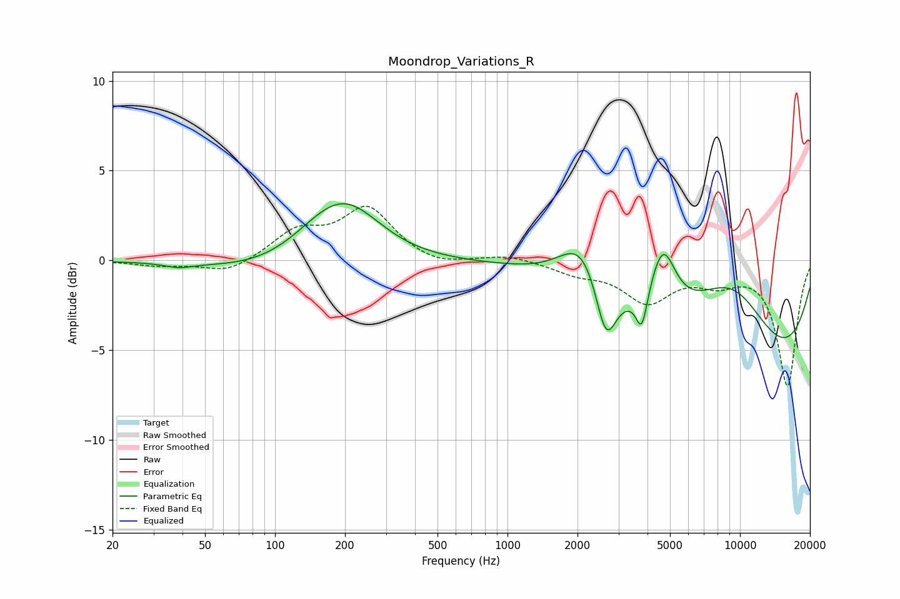

# Moondrop_Variations_R
See [usage instructions](https://github.com/jaakkopasanen/AutoEq#usage) for more options and info.

### Parametric EQs
Apply preamp of -3.3 dB when using parametric equalizer.

|   # | Type    |   Fc (Hz) |    Q |   Gain (dB) |
|-----|---------|-----------|------|-------------|
|   1 | Peaking |        39 | 2.39 |        -0.3 |
|   2 | Peaking |       143 | 0.47 |        -1.7 |
|   3 | Peaking |       154 | 0.8  |         1.4 |
|   4 | Peaking |       201 | 0.87 |         3.5 |
|   5 | Peaking |      2101 | 1.47 |         2.8 |
|   6 | Peaking |      2650 | 3.17 |        -3.4 |
|   7 | Peaking |      3779 | 5.77 |        -2.1 |
|   8 | Peaking |      4655 | 2.53 |         3.5 |
|   9 | Peaking |      9145 | 0.58 |         7.7 |
|  10 | Peaking |     10000 | 0.29 |        -9.5 |

### Fixed Band EQs
When using fixed band (also called graphic) equalizer, apply preamp of **-3.1 dB** (if available) and set gains manually with these parameters.

|   # | Type    |   Fc (Hz) |    Q |   Gain (dB) |
|-----|---------|-----------|------|-------------|
|   1 | Peaking |        31 | 1.41 |        -0.3 |
|   2 | Peaking |        62 | 1.41 |        -0.7 |
|   3 | Peaking |       125 | 1.41 |         1.5 |
|   4 | Peaking |       250 | 1.41 |         2.8 |
|   5 | Peaking |       500 | 1.41 |        -0.4 |
|   6 | Peaking |      1000 | 1.41 |         0.3 |
|   7 | Peaking |      2000 | 1.41 |        -0.6 |
|   8 | Peaking |      4000 | 1.41 |        -2.2 |
|   9 | Peaking |      8000 | 1.41 |        -1   |
|  10 | Peaking |     16000 | 1.41 |        -6.9 |

### Graphs

