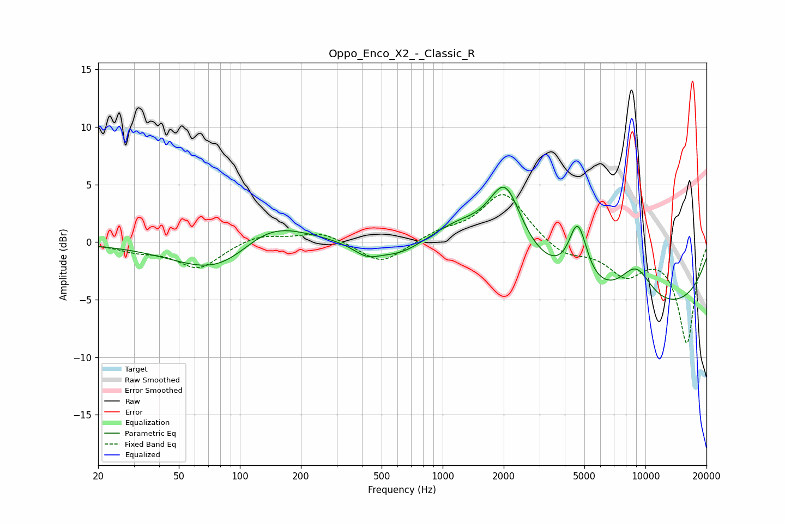

# Oppo_Enco_X2_-_Classic_R
See [usage instructions](https://github.com/jaakkopasanen/AutoEq#usage) for more options and info.

### Parametric EQs
Apply preamp of -4.9 dB when using parametric equalizer.

|   # | Type    |   Fc (Hz) |    Q |   Gain (dB) |
|-----|---------|-----------|------|-------------|
|   1 | Peaking |        87 | 0.64 |        -4.2 |
|   2 | Peaking |       132 | 0.74 |         3.8 |
|   3 | Peaking |       421 | 2.11 |        -1   |
|   4 | Peaking |       614 | 1.19 |        -1.3 |
|   5 | Peaking |      1208 | 0.98 |         1.9 |
|   6 | Peaking |      2035 | 1.76 |         5.9 |
|   7 | Peaking |      4617 | 3.22 |         4.9 |
|   8 | Peaking |      5010 | 4.74 |         0.3 |
|   9 | Peaking |      8968 | 1.54 |         3.3 |
|  10 | Peaking |     10000 | 0.24 |        -6   |

### Fixed Band EQs
When using fixed band (also called graphic) equalizer, apply preamp of **-4.2 dB** (if available) and set gains manually with these parameters.

|   # | Type    |   Fc (Hz) |    Q |   Gain (dB) |
|-----|---------|-----------|------|-------------|
|   1 | Peaking |        31 | 1.41 |        -0.6 |
|   2 | Peaking |        62 | 1.41 |        -2.2 |
|   3 | Peaking |       125 | 1.41 |         0.7 |
|   4 | Peaking |       250 | 1.41 |         0.9 |
|   5 | Peaking |       500 | 1.41 |        -1.9 |
|   6 | Peaking |      1000 | 1.41 |         0.8 |
|   7 | Peaking |      2000 | 1.41 |         4.3 |
|   8 | Peaking |      4000 | 1.41 |        -1.2 |
|   9 | Peaking |      8000 | 1.41 |        -2.6 |
|  10 | Peaking |     16000 | 1.41 |        -8.7 |

### Graphs

