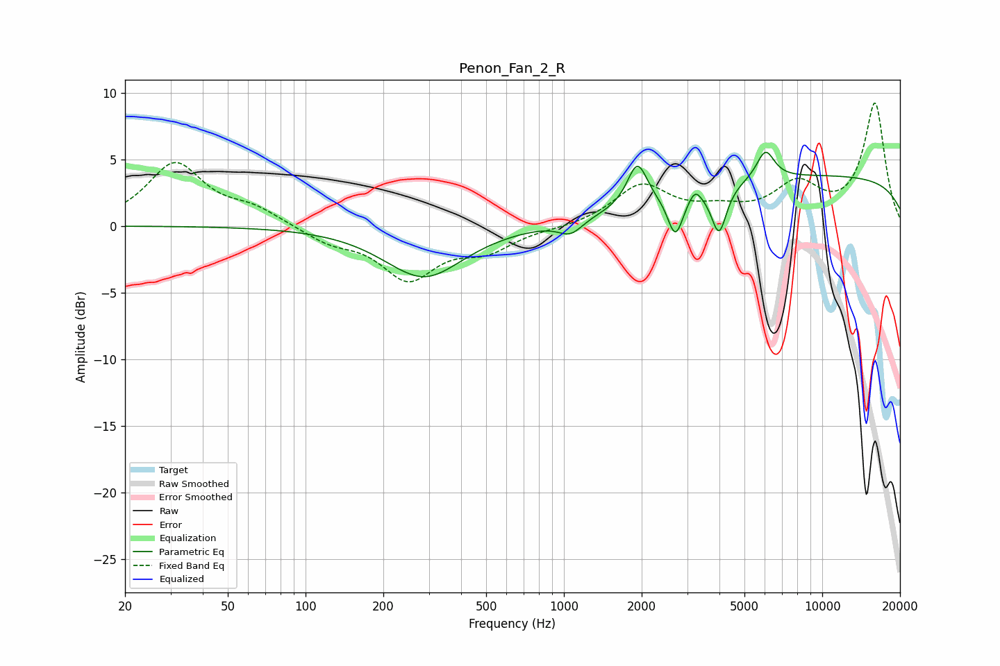

# Penon_Fan_2_R
See [usage instructions](https://github.com/jaakkopasanen/AutoEq#usage) for more options and info.

### Parametric EQs
Apply preamp of -5.6 dB when using parametric equalizer.

|   # | Type    |   Fc (Hz) |    Q |   Gain (dB) |
|-----|---------|-----------|------|-------------|
|   1 | Peaking |       250 | 3.09 |         0   |
|   2 | Peaking |       287 | 0.94 |        -3.9 |
|   3 | Peaking |      1062 | 3.02 |        -1.1 |
|   4 | Peaking |      1227 | 3.99 |         0   |
|   5 | Peaking |      1924 | 3.67 |         3.3 |
|   6 | Peaking |      2702 | 4.73 |        -3.1 |
|   7 | Peaking |      3217 | 6    |         0.9 |
|   8 | Peaking |      3985 | 4.85 |        -3.5 |
|   9 | Peaking |      6029 | 3.96 |         2.2 |
|  10 | Peaking |     10000 | 0.18 |         3.7 |

### Fixed Band EQs
When using fixed band (also called graphic) equalizer, apply preamp of **-9.3 dB** (if available) and set gains manually with these parameters.

|   # | Type    |   Fc (Hz) |    Q |   Gain (dB) |
|-----|---------|-----------|------|-------------|
|   1 | Peaking |        31 | 1.41 |         4.6 |
|   2 | Peaking |        62 | 1.41 |         1.1 |
|   3 | Peaking |       125 | 1.41 |        -1.1 |
|   4 | Peaking |       250 | 1.41 |        -3.8 |
|   5 | Peaking |       500 | 1.41 |        -1.6 |
|   6 | Peaking |      1000 | 1.41 |        -0.1 |
|   7 | Peaking |      2000 | 1.41 |         3   |
|   8 | Peaking |      4000 | 1.41 |         0.9 |
|   9 | Peaking |      8000 | 1.41 |         2.8 |
|  10 | Peaking |     16000 | 1.41 |         9.1 |

### Graphs

