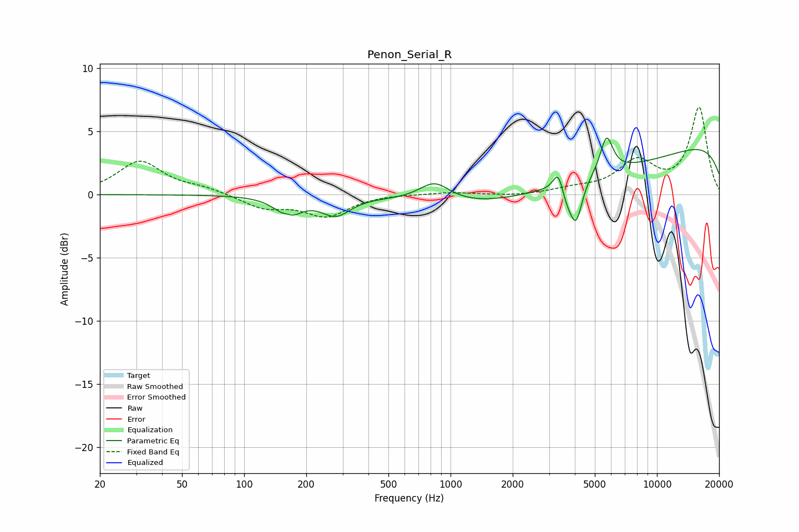

# Penon_Serial_R
See [usage instructions](https://github.com/jaakkopasanen/AutoEq#usage) for more options and info.

### Parametric EQs
Apply preamp of -4.6 dB when using parametric equalizer.

|   # | Type    |   Fc (Hz) |    Q |   Gain (dB) |
|-----|---------|-----------|------|-------------|
|   1 | Peaking |       162 | 4.73 |         0.5 |
|   2 | Peaking |       163 | 2.55 |        -1.8 |
|   3 | Peaking |       278 | 2.03 |        -1.5 |
|   4 | Peaking |       836 | 1.91 |         1.5 |
|   5 | Peaking |      3329 | 5.8  |         1.8 |
|   6 | Peaking |      3670 | 3.99 |        -1.4 |
|   7 | Peaking |      4065 | 4.92 |        -2.9 |
|   8 | Peaking |      4213 | 0.23 |        -2.9 |
|   9 | Peaking |      5700 | 4.51 |         2.9 |
|  10 | Peaking |     10000 | 0.18 |         5.1 |

### Fixed Band EQs
When using fixed band (also called graphic) equalizer, apply preamp of **-7.0 dB** (if available) and set gains manually with these parameters.

|   # | Type    |   Fc (Hz) |    Q |   Gain (dB) |
|-----|---------|-----------|------|-------------|
|   1 | Peaking |        31 | 1.41 |         2.6 |
|   2 | Peaking |        62 | 1.41 |         0.4 |
|   3 | Peaking |       125 | 1.41 |        -1   |
|   4 | Peaking |       250 | 1.41 |        -1.6 |
|   5 | Peaking |       500 | 1.41 |         0.1 |
|   6 | Peaking |      1000 | 1.41 |         0.2 |
|   7 | Peaking |      2000 | 1.41 |        -0.1 |
|   8 | Peaking |      4000 | 1.41 |         0.4 |
|   9 | Peaking |      8000 | 1.41 |         2.5 |
|  10 | Peaking |     16000 | 1.41 |         6.8 |

### Graphs

