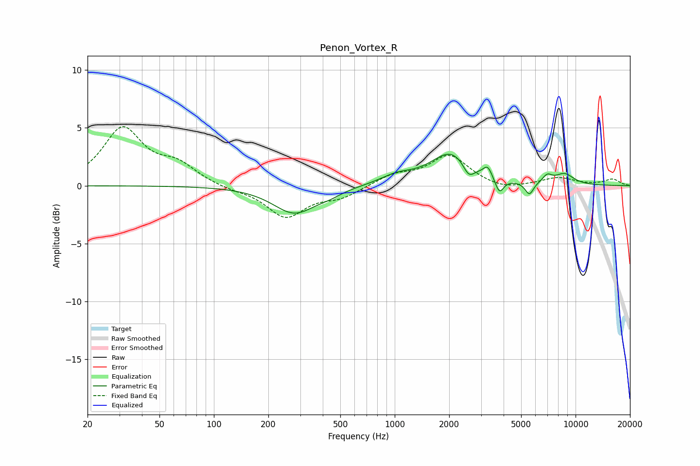

# Penon_Vortex_R
See [usage instructions](https://github.com/jaakkopasanen/AutoEq#usage) for more options and info.

### Parametric EQs
Apply preamp of -2.8 dB when using parametric equalizer.

|   # | Type    |   Fc (Hz) |    Q |   Gain (dB) |
|-----|---------|-----------|------|-------------|
|   1 | Peaking |       279 | 1.19 |        -2.4 |
|   2 | Peaking |       437 | 2.25 |        -0.3 |
|   3 | Peaking |      1023 | 1.53 |         0.7 |
|   4 | Peaking |      2059 | 1.26 |         2.8 |
|   5 | Peaking |      2567 | 4.38 |        -1.2 |
|   6 | Peaking |      3267 | 6    |         0.9 |
|   7 | Peaking |      3791 | 6    |        -1.3 |
|   8 | Peaking |      5554 | 5.9  |        -1.1 |
|   9 | Peaking |      6972 | 5.18 |         0.6 |
|  10 | Peaking |      8675 | 2.43 |         0.9 |

### Fixed Band EQs
When using fixed band (also called graphic) equalizer, apply preamp of **-5.2 dB** (if available) and set gains manually with these parameters.

|   # | Type    |   Fc (Hz) |    Q |   Gain (dB) |
|-----|---------|-----------|------|-------------|
|   1 | Peaking |        31 | 1.41 |         4.8 |
|   2 | Peaking |        62 | 1.41 |         1.6 |
|   3 | Peaking |       125 | 1.41 |        -0.3 |
|   4 | Peaking |       250 | 1.41 |        -2.7 |
|   5 | Peaking |       500 | 1.41 |        -0.9 |
|   6 | Peaking |      1000 | 1.41 |         0.9 |
|   7 | Peaking |      2000 | 1.41 |         2.6 |
|   8 | Peaking |      4000 | 1.41 |        -0.5 |
|   9 | Peaking |      8000 | 1.41 |         0.7 |
|  10 | Peaking |     16000 | 1.41 |         0.5 |

### Graphs

