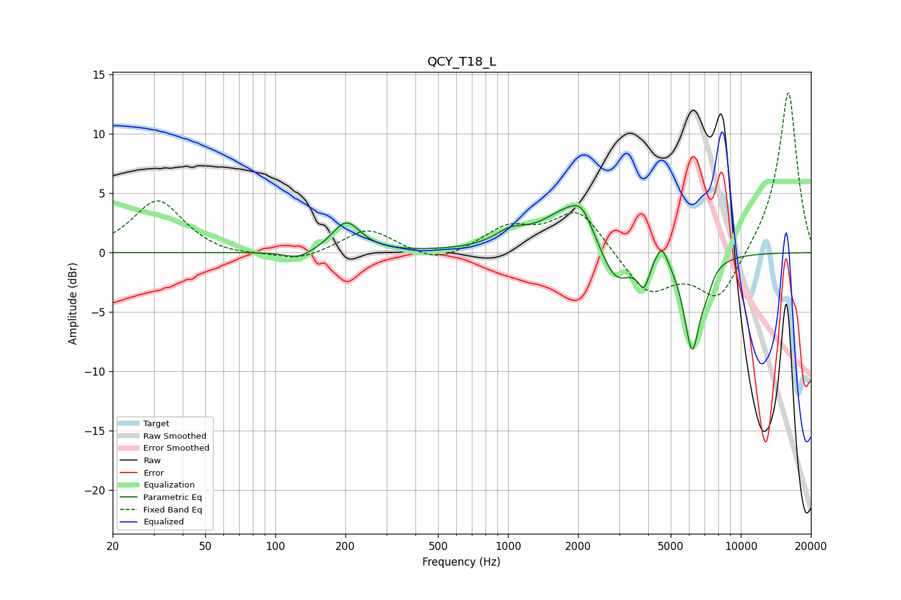

# QCY_T18_L
See [usage instructions](https://github.com/jaakkopasanen/AutoEq#usage) for more options and info.

### Parametric EQs
Apply preamp of -4.1 dB when using parametric equalizer.

|   # | Type    |   Fc (Hz) |    Q |   Gain (dB) |
|-----|---------|-----------|------|-------------|
|   1 | Peaking |       126 | 2.33 |        -0.7 |
|   2 | Peaking |       202 | 2.33 |         2.6 |
|   3 | Peaking |      1022 | 2.16 |         1.1 |
|   4 | Peaking |      1890 | 1.14 |         3.9 |
|   5 | Peaking |      2078 | 3.32 |         1.3 |
|   6 | Peaking |      2886 | 1.89 |        -3.8 |
|   7 | Peaking |      3830 | 5.98 |        -2.2 |
|   8 | Peaking |      4565 | 5.05 |         1.8 |
|   9 | Peaking |      6177 | 3.84 |        -8.1 |
|  10 | Peaking |      7157 | 6    |        -1   |

### Fixed Band EQs
When using fixed band (also called graphic) equalizer, apply preamp of **-13.6 dB** (if available) and set gains manually with these parameters.

|   # | Type    |   Fc (Hz) |    Q |   Gain (dB) |
|-----|---------|-----------|------|-------------|
|   1 | Peaking |        31 | 1.41 |         4.4 |
|   2 | Peaking |        62 | 1.41 |        -0.4 |
|   3 | Peaking |       125 | 1.41 |        -0.8 |
|   4 | Peaking |       250 | 1.41 |         2   |
|   5 | Peaking |       500 | 1.41 |        -1   |
|   6 | Peaking |      1000 | 1.41 |         2   |
|   7 | Peaking |      2000 | 1.41 |         3.7 |
|   8 | Peaking |      4000 | 1.41 |        -3.5 |
|   9 | Peaking |      8000 | 1.41 |        -4.1 |
|  10 | Peaking |     16000 | 1.41 |        13.8 |

### Graphs

