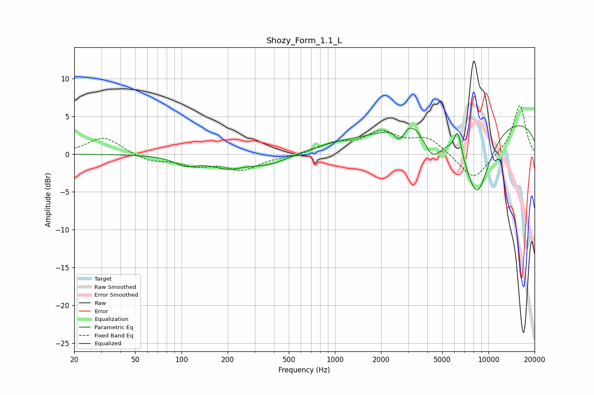

# Shozy_Form_1.1_L
See [usage instructions](https://github.com/jaakkopasanen/AutoEq#usage) for more options and info.

### Parametric EQs
Apply preamp of -3.8 dB when using parametric equalizer.

|   # | Type    |   Fc (Hz) |    Q |   Gain (dB) |
|-----|---------|-----------|------|-------------|
|   1 | Peaking |       108 | 1.81 |        -1.2 |
|   2 | Peaking |       199 | 1.33 |        -1.4 |
|   3 | Peaking |       370 | 0.97 |        -1.4 |
|   4 | Peaking |      1017 | 0.62 |         1   |
|   5 | Peaking |      2639 | 4.38 |        -2   |
|   6 | Peaking |      3160 | 1.38 |         2.3 |
|   7 | Peaking |      4292 | 2.12 |        -4   |
|   8 | Peaking |      6321 | 5.88 |         3.2 |
|   9 | Peaking |      8420 | 1.43 |        -9.8 |
|  10 | Peaking |     10000 | 0.18 |         5.1 |

### Fixed Band EQs
When using fixed band (also called graphic) equalizer, apply preamp of **-6.5 dB** (if available) and set gains manually with these parameters.

|   # | Type    |   Fc (Hz) |    Q |   Gain (dB) |
|-----|---------|-----------|------|-------------|
|   1 | Peaking |        31 | 1.41 |         2.3 |
|   2 | Peaking |        62 | 1.41 |        -0.9 |
|   3 | Peaking |       125 | 1.41 |        -1.3 |
|   4 | Peaking |       250 | 1.41 |        -1.9 |
|   5 | Peaking |       500 | 1.41 |        -0.3 |
|   6 | Peaking |      1000 | 1.41 |         1.3 |
|   7 | Peaking |      2000 | 1.41 |         2.7 |
|   8 | Peaking |      4000 | 1.41 |         2.1 |
|   9 | Peaking |      8000 | 1.41 |        -3.6 |
|  10 | Peaking |     16000 | 1.41 |         6.6 |

### Graphs

