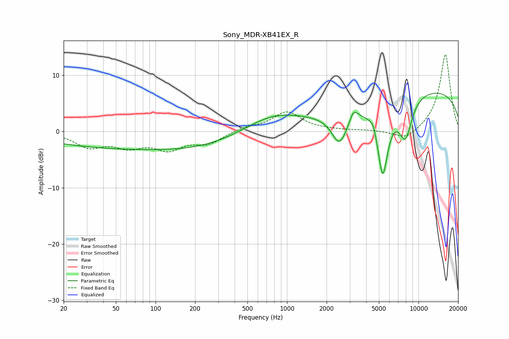

# Sony_MDR-XB41EX_R
See [usage instructions](https://github.com/jaakkopasanen/AutoEq#usage) for more options and info.

### Parametric EQs
Apply preamp of -6.9 dB when using parametric equalizer.

|   # | Type    |   Fc (Hz) |    Q |   Gain (dB) |
|-----|---------|-----------|------|-------------|
|   1 | Peaking |        75 | 0.18 |        -3   |
|   2 | Peaking |       521 | 0.24 |        -0.9 |
|   3 | Peaking |       779 | 0.62 |         3.5 |
|   4 | Peaking |      2224 | 2.38 |         0.8 |
|   5 | Peaking |      2489 | 2.05 |        -6.8 |
|   6 | Peaking |      3195 | 4.61 |         2.1 |
|   7 | Peaking |      4519 | 5.98 |         1.3 |
|   8 | Peaking |      5346 | 3.18 |       -13.2 |
|   9 | Peaking |      7952 | 2.58 |        -7.1 |
|  10 | Peaking |     10000 | 0.18 |         7.6 |

### Fixed Band EQs
When using fixed band (also called graphic) equalizer, apply preamp of **-13.8 dB** (if available) and set gains manually with these parameters.

|   # | Type    |   Fc (Hz) |    Q |   Gain (dB) |
|-----|---------|-----------|------|-------------|
|   1 | Peaking |        31 | 1.41 |        -2.5 |
|   2 | Peaking |        62 | 1.41 |        -2.3 |
|   3 | Peaking |       125 | 1.41 |        -2.8 |
|   4 | Peaking |       250 | 1.41 |        -2   |
|   5 | Peaking |       500 | 1.41 |         0.7 |
|   6 | Peaking |      1000 | 1.41 |         3.4 |
|   7 | Peaking |      2000 | 1.41 |         0.2 |
|   8 | Peaking |      4000 | 1.41 |         0.2 |
|   9 | Peaking |      8000 | 1.41 |        -1.7 |
|  10 | Peaking |     16000 | 1.41 |        13.9 |

### Graphs

