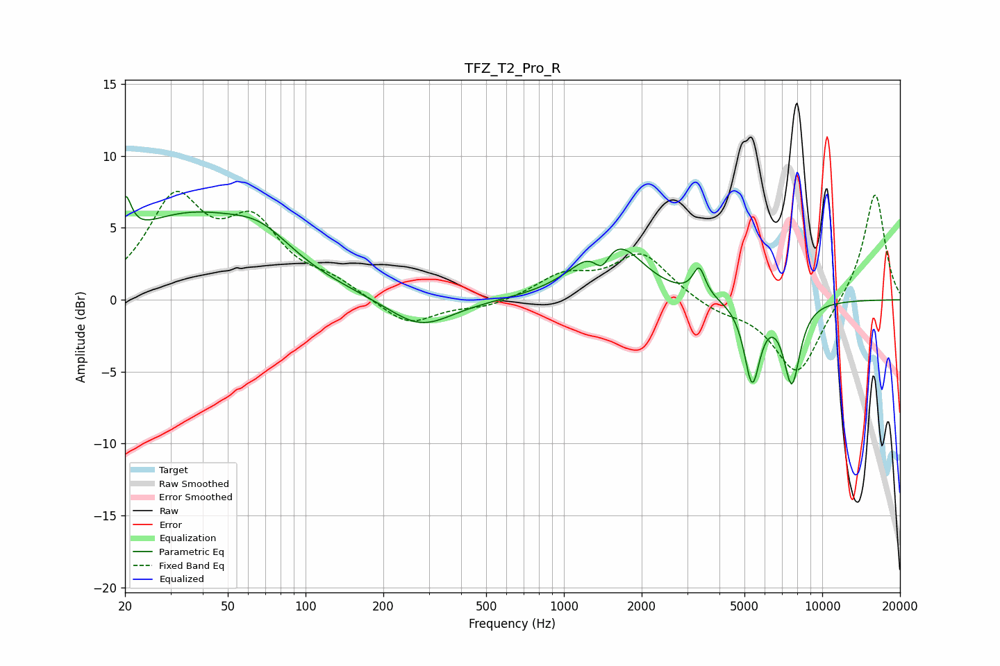

# TFZ_T2_Pro_R
See [usage instructions](https://github.com/jaakkopasanen/AutoEq#usage) for more options and info.

### Parametric EQs
Apply preamp of -7.3 dB when using parametric equalizer.

|   # | Type    |   Fc (Hz) |    Q |   Gain (dB) |
|-----|---------|-----------|------|-------------|
|   1 | Peaking |        20 | 5.98 |         2.9 |
|   2 | Peaking |        34 | 0.49 |         5.6 |
|   3 | Peaking |        67 | 1.18 |         1.8 |
|   4 | Peaking |       278 | 1.12 |        -2.1 |
|   5 | Peaking |      1403 | 4.2  |        -1.9 |
|   6 | Peaking |      1428 | 1.33 |         3.7 |
|   7 | Peaking |      1738 | 1.64 |         1.1 |
|   8 | Peaking |      3338 | 6    |         1.9 |
|   9 | Peaking |      5355 | 4.52 |        -5.6 |
|  10 | Peaking |      7627 | 4.11 |        -5.6 |

### Fixed Band EQs
When using fixed band (also called graphic) equalizer, apply preamp of **-7.6 dB** (if available) and set gains manually with these parameters.

|   # | Type    |   Fc (Hz) |    Q |   Gain (dB) |
|-----|---------|-----------|------|-------------|
|   1 | Peaking |        31 | 1.41 |         6.6 |
|   2 | Peaking |        62 | 1.41 |         4.7 |
|   3 | Peaking |       125 | 1.41 |         1   |
|   4 | Peaking |       250 | 1.41 |        -1.8 |
|   5 | Peaking |       500 | 1.41 |        -0.5 |
|   6 | Peaking |      1000 | 1.41 |         1.6 |
|   7 | Peaking |      2000 | 1.41 |         3.2 |
|   8 | Peaking |      4000 | 1.41 |        -0.7 |
|   9 | Peaking |      8000 | 1.41 |        -5.3 |
|  10 | Peaking |     16000 | 1.41 |         7.6 |

### Graphs

