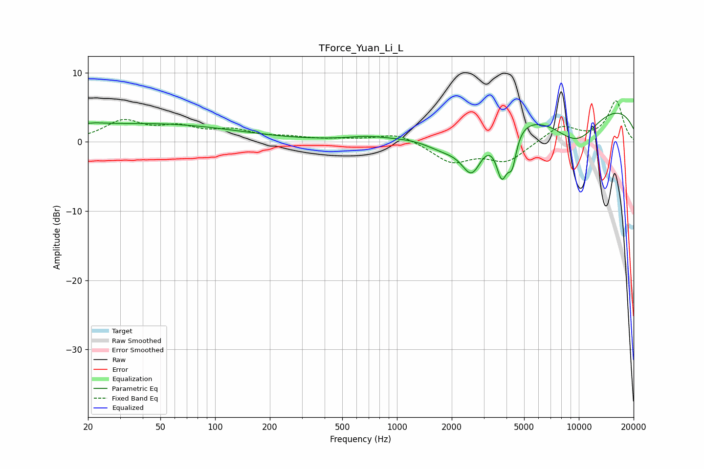

# TForce_Yuan_Li_L
See [usage instructions](https://github.com/jaakkopasanen/AutoEq#usage) for more options and info.

### Parametric EQs
Apply preamp of -4.2 dB when using parametric equalizer.

|   # | Type    |   Fc (Hz) |    Q |   Gain (dB) |
|-----|---------|-----------|------|-------------|
|   1 | Peaking |        20 | 1.62 |         0.7 |
|   2 | Peaking |        32 | 5.93 |         0   |
|   3 | Peaking |        45 | 0.3  |         2.6 |
|   4 | Peaking |       674 | 1.44 |         0.4 |
|   5 | Peaking |      1840 | 1.22 |        -2.6 |
|   6 | Peaking |      2579 | 2.37 |        -5.9 |
|   7 | Peaking |      3772 | 4.38 |        -6.6 |
|   8 | Peaking |      4299 | 5.88 |        -4.4 |
|   9 | Peaking |      9534 | 0.18 |         6.3 |
|  10 | Peaking |      9638 | 0.9  |        -5.6 |

### Fixed Band EQs
When using fixed band (also called graphic) equalizer, apply preamp of **-6.0 dB** (if available) and set gains manually with these parameters.

|   # | Type    |   Fc (Hz) |    Q |   Gain (dB) |
|-----|---------|-----------|------|-------------|
|   1 | Peaking |        31 | 1.41 |         2.8 |
|   2 | Peaking |        62 | 1.41 |         1.8 |
|   3 | Peaking |       125 | 1.41 |         1.5 |
|   4 | Peaking |       250 | 1.41 |         0.5 |
|   5 | Peaking |       500 | 1.41 |         0.3 |
|   6 | Peaking |      1000 | 1.41 |         1.3 |
|   7 | Peaking |      2000 | 1.41 |        -2.8 |
|   8 | Peaking |      4000 | 1.41 |        -2.8 |
|   9 | Peaking |      8000 | 1.41 |         2.4 |
|  10 | Peaking |     16000 | 1.41 |         5.9 |

### Graphs

