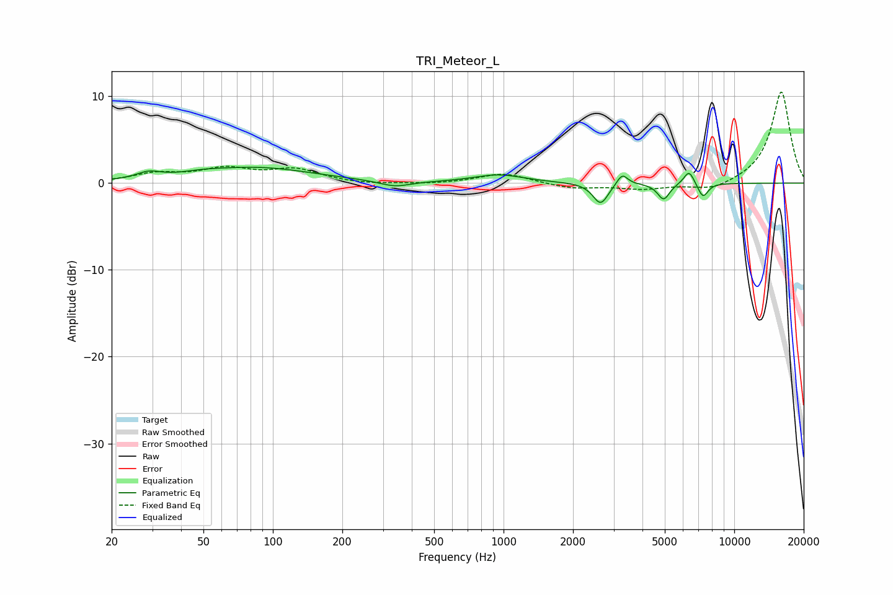

# TRI_Meteor_L
See [usage instructions](https://github.com/jaakkopasanen/AutoEq#usage) for more options and info.

### Parametric EQs
Apply preamp of -1.9 dB when using parametric equalizer.

|   # | Type    |   Fc (Hz) |    Q |   Gain (dB) |
|-----|---------|-----------|------|-------------|
|   1 | Peaking |        29 | 2.64 |         0.8 |
|   2 | Peaking |        49 | 1.48 |         0.3 |
|   3 | Peaking |        86 | 0.59 |         1.7 |
|   4 | Peaking |       338 | 2.11 |        -0.7 |
|   5 | Peaking |       951 | 1.32 |         0.9 |
|   6 | Peaking |      2635 | 4.29 |        -2.4 |
|   7 | Peaking |      3269 | 6    |         1.3 |
|   8 | Peaking |      4941 | 5.37 |        -1.9 |
|   9 | Peaking |      6370 | 5.96 |         1.7 |
|  10 | Peaking |      7315 | 6    |        -1.7 |

### Fixed Band EQs
When using fixed band (also called graphic) equalizer, apply preamp of **-10.6 dB** (if available) and set gains manually with these parameters.

|   # | Type    |   Fc (Hz) |    Q |   Gain (dB) |
|-----|---------|-----------|------|-------------|
|   1 | Peaking |        31 | 1.41 |         1   |
|   2 | Peaking |        62 | 1.41 |         1.5 |
|   3 | Peaking |       125 | 1.41 |         1.5 |
|   4 | Peaking |       250 | 1.41 |        -0.2 |
|   5 | Peaking |       500 | 1.41 |        -0.1 |
|   6 | Peaking |      1000 | 1.41 |         1.2 |
|   7 | Peaking |      2000 | 1.41 |        -0.6 |
|   8 | Peaking |      4000 | 1.41 |        -0.6 |
|   9 | Peaking |      8000 | 1.41 |        -0.9 |
|  10 | Peaking |     16000 | 1.41 |        10.6 |

### Graphs

