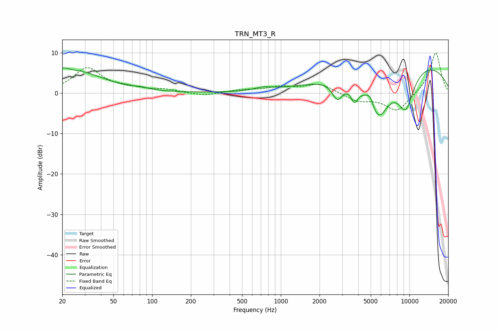

# TRN_MT3_R
See [usage instructions](https://github.com/jaakkopasanen/AutoEq#usage) for more options and info.

### Parametric EQs
Apply preamp of -6.4 dB when using parametric equalizer.

|   # | Type    |   Fc (Hz) |    Q |   Gain (dB) |
|-----|---------|-----------|------|-------------|
|   1 | Peaking |        20 | 3.69 |         1.1 |
|   2 | Peaking |        24 | 0.62 |         5.4 |
|   3 | Peaking |        82 | 3.24 |         0.4 |
|   4 | Peaking |       731 | 1.98 |         0.8 |
|   5 | Peaking |      2754 | 3.39 |        -4.4 |
|   6 | Peaking |      3736 | 5.12 |        -3.5 |
|   7 | Peaking |      4920 | 4.36 |         2.6 |
|   8 | Peaking |      5716 | 1.43 |       -12.5 |
|   9 | Peaking |      8790 | 0.23 |         8.9 |
|  10 | Peaking |      9359 | 1.85 |        -9.6 |

### Fixed Band EQs
When using fixed band (also called graphic) equalizer, apply preamp of **-10.0 dB** (if available) and set gains manually with these parameters.

|   # | Type    |   Fc (Hz) |    Q |   Gain (dB) |
|-----|---------|-----------|------|-------------|
|   1 | Peaking |        31 | 1.41 |         6.1 |
|   2 | Peaking |        62 | 1.41 |         1   |
|   3 | Peaking |       125 | 1.41 |         0.8 |
|   4 | Peaking |       250 | 1.41 |        -0.8 |
|   5 | Peaking |       500 | 1.41 |         0.7 |
|   6 | Peaking |      1000 | 1.41 |         1.3 |
|   7 | Peaking |      2000 | 1.41 |         2.3 |
|   8 | Peaking |      4000 | 1.41 |        -1.9 |
|   9 | Peaking |      8000 | 1.41 |        -4.5 |
|  10 | Peaking |     16000 | 1.41 |        10.2 |

### Graphs

