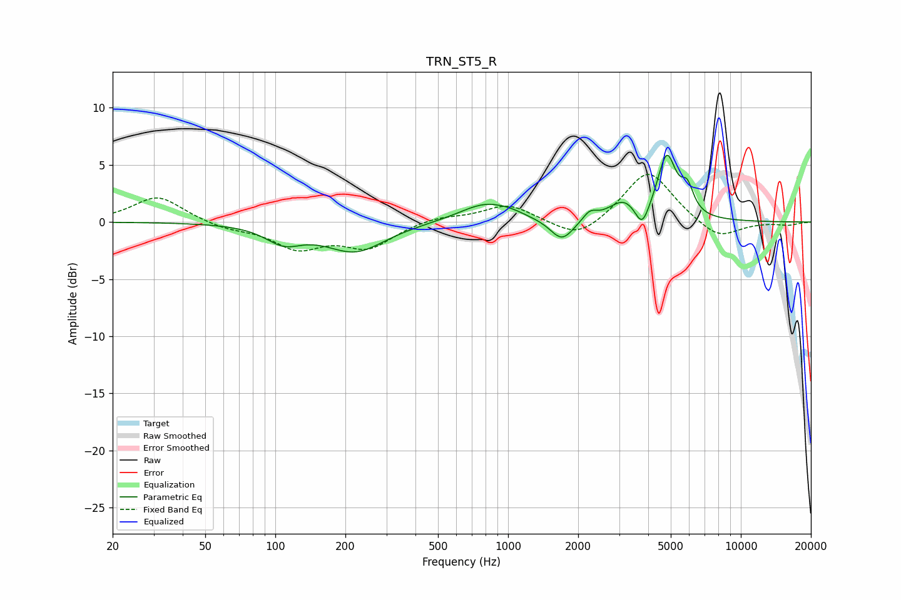

# TRN_ST5_R
See [usage instructions](https://github.com/jaakkopasanen/AutoEq#usage) for more options and info.

### Parametric EQs
Apply preamp of -6.0 dB when using parametric equalizer.

|   # | Type    |   Fc (Hz) |    Q |   Gain (dB) |
|-----|---------|-----------|------|-------------|
|   1 | Peaking |       109 | 1.82 |        -1.5 |
|   2 | Peaking |       220 | 1.09 |        -2.5 |
|   3 | Peaking |       805 | 1.23 |         1.7 |
|   4 | Peaking |      1034 | 2.62 |         0.2 |
|   5 | Peaking |      1705 | 2.81 |        -1.9 |
|   6 | Peaking |      2243 | 4.87 |         0.8 |
|   7 | Peaking |      3140 | 2.26 |         1.7 |
|   8 | Peaking |      3767 | 4.7  |        -2.1 |
|   9 | Peaking |      4806 | 3.52 |         5.5 |
|  10 | Peaking |      5886 | 5.11 |         2.1 |

### Fixed Band EQs
When using fixed band (also called graphic) equalizer, apply preamp of **-4.3 dB** (if available) and set gains manually with these parameters.

|   # | Type    |   Fc (Hz) |    Q |   Gain (dB) |
|-----|---------|-----------|------|-------------|
|   1 | Peaking |        31 | 1.41 |         2.3 |
|   2 | Peaking |        62 | 1.41 |        -0.5 |
|   3 | Peaking |       125 | 1.41 |        -2.1 |
|   4 | Peaking |       250 | 1.41 |        -2.1 |
|   5 | Peaking |       500 | 1.41 |         0.5 |
|   6 | Peaking |      1000 | 1.41 |         1.5 |
|   7 | Peaking |      2000 | 1.41 |        -1.7 |
|   8 | Peaking |      4000 | 1.41 |         4.6 |
|   9 | Peaking |      8000 | 1.41 |        -1.6 |
|  10 | Peaking |     16000 | 1.41 |        -0.3 |

### Graphs

