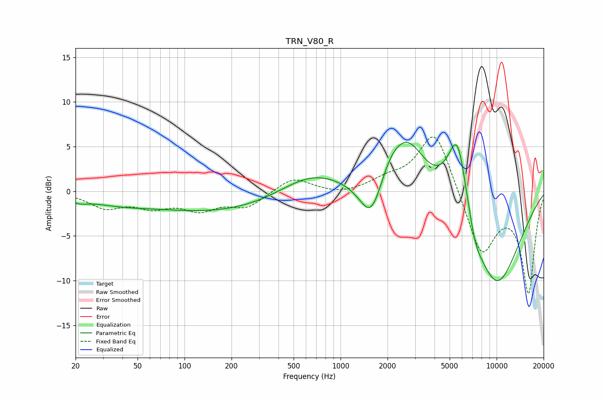

# TRN_V80_R
See [usage instructions](https://github.com/jaakkopasanen/AutoEq#usage) for more options and info.

### Parametric EQs
Apply preamp of -5.6 dB when using parametric equalizer.

|   # | Type    |   Fc (Hz) |    Q |   Gain (dB) |
|-----|---------|-----------|------|-------------|
|   1 | Peaking |        21 | 2.57 |        -0.5 |
|   2 | Peaking |        37 | 0.65 |        -1   |
|   3 | Peaking |       180 | 0.31 |        -2.3 |
|   4 | Peaking |       647 | 0.67 |         2.6 |
|   5 | Peaking |      1579 | 1.87 |        -5.3 |
|   6 | Peaking |      2060 | 1.52 |         2.5 |
|   7 | Peaking |      2717 | 1.22 |         5.3 |
|   8 | Peaking |      5617 | 1.99 |         9.6 |
|   9 | Peaking |      7289 | 2.98 |        -1.9 |
|  10 | Peaking |      9832 | 0.69 |       -11   |

### Fixed Band EQs
When using fixed band (also called graphic) equalizer, apply preamp of **-6.2 dB** (if available) and set gains manually with these parameters.

|   # | Type    |   Fc (Hz) |    Q |   Gain (dB) |
|-----|---------|-----------|------|-------------|
|   1 | Peaking |        31 | 1.41 |        -1.7 |
|   2 | Peaking |        62 | 1.41 |        -1.5 |
|   3 | Peaking |       125 | 1.41 |        -1.8 |
|   4 | Peaking |       250 | 1.41 |        -1.7 |
|   5 | Peaking |       500 | 1.41 |         1.6 |
|   6 | Peaking |      1000 | 1.41 |        -0.4 |
|   7 | Peaking |      2000 | 1.41 |         1.1 |
|   8 | Peaking |      4000 | 1.41 |         7.1 |
|   9 | Peaking |      8000 | 1.41 |        -7.1 |
|  10 | Peaking |     16000 | 1.41 |       -11.2 |

### Graphs

