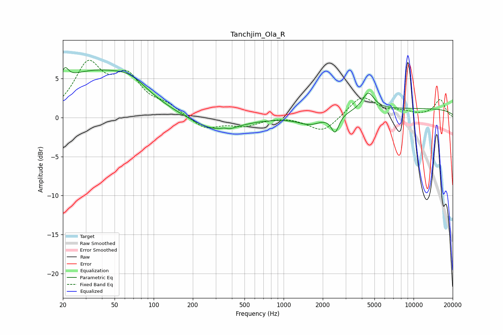

# Tanchjim_Ola_R
See [usage instructions](https://github.com/jaakkopasanen/AutoEq#usage) for more options and info.

### Parametric EQs
Apply preamp of -6.5 dB when using parametric equalizer.

|   # | Type    |   Fc (Hz) |    Q |   Gain (dB) |
|-----|---------|-----------|------|-------------|
|   1 | Peaking |        21 | 5.38 |         1.6 |
|   2 | Peaking |        33 | 0.43 |         5.6 |
|   3 | Peaking |        66 | 1.1  |         1.7 |
|   4 | Peaking |       298 | 0.8  |        -1.9 |
|   5 | Peaking |       361 | 3.85 |         2.4 |
|   6 | Peaking |       363 | 3.76 |        -2.4 |
|   7 | Peaking |      1603 | 1.53 |        -1.1 |
|   8 | Peaking |      2489 | 4.85 |        -2.3 |
|   9 | Peaking |      4476 | 3.1  |         2.3 |
|  10 | Peaking |     10000 | 0.18 |         1.1 |

### Fixed Band EQs
When using fixed band (also called graphic) equalizer, apply preamp of **-7.4 dB** (if available) and set gains manually with these parameters.

|   # | Type    |   Fc (Hz) |    Q |   Gain (dB) |
|-----|---------|-----------|------|-------------|
|   1 | Peaking |        31 | 1.41 |         6.4 |
|   2 | Peaking |        62 | 1.41 |         4.6 |
|   3 | Peaking |       125 | 1.41 |         1.2 |
|   4 | Peaking |       250 | 1.41 |        -1.5 |
|   5 | Peaking |       500 | 1.41 |        -1   |
|   6 | Peaking |      1000 | 1.41 |         0.2 |
|   7 | Peaking |      2000 | 1.41 |        -2   |
|   8 | Peaking |      4000 | 1.41 |         2.7 |
|   9 | Peaking |      8000 | 1.41 |         0.6 |
|  10 | Peaking |     16000 | 1.41 |         2.3 |

### Graphs

