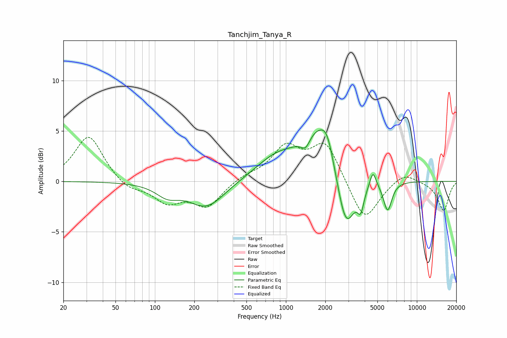

# Tanchjim_Tanya_R
See [usage instructions](https://github.com/jaakkopasanen/AutoEq#usage) for more options and info.

### Parametric EQs
Apply preamp of -5.2 dB when using parametric equalizer.

|   # | Type    |   Fc (Hz) |    Q |   Gain (dB) |
|-----|---------|-----------|------|-------------|
|   1 | Peaking |       124 | 1.64 |        -1.1 |
|   2 | Peaking |       248 | 1.03 |        -2.6 |
|   3 | Peaking |       838 | 0.89 |         2   |
|   4 | Peaking |      1414 | 4.1  |        -1.2 |
|   5 | Peaking |      1817 | 1.04 |         5.2 |
|   6 | Peaking |      2065 | 3.08 |         1.7 |
|   7 | Peaking |      2863 | 1.97 |        -6.4 |
|   8 | Peaking |      3726 | 6    |        -1.9 |
|   9 | Peaking |      4617 | 5.86 |         1.6 |
|  10 | Peaking |      5981 | 4.35 |        -2.9 |

### Fixed Band EQs
When using fixed band (also called graphic) equalizer, apply preamp of **-4.5 dB** (if available) and set gains manually with these parameters.

|   # | Type    |   Fc (Hz) |    Q |   Gain (dB) |
|-----|---------|-----------|------|-------------|
|   1 | Peaking |        31 | 1.41 |         4.6 |
|   2 | Peaking |        62 | 1.41 |        -0.9 |
|   3 | Peaking |       125 | 1.41 |        -1.9 |
|   4 | Peaking |       250 | 1.41 |        -2.4 |
|   5 | Peaking |       500 | 1.41 |         0.5 |
|   6 | Peaking |      1000 | 1.41 |         3.2 |
|   7 | Peaking |      2000 | 1.41 |         3.8 |
|   8 | Peaking |      4000 | 1.41 |        -4.1 |
|   9 | Peaking |      8000 | 1.41 |         1   |
|  10 | Peaking |     16000 | 1.41 |        -2.9 |

### Graphs

