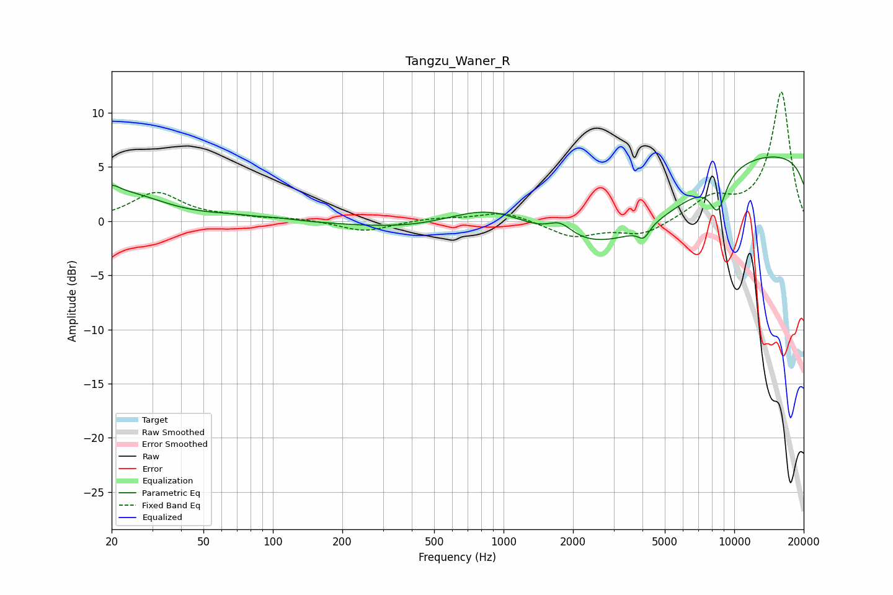

# Tangzu_Waner_R
See [usage instructions](https://github.com/jaakkopasanen/AutoEq#usage) for more options and info.

### Parametric EQs
Apply preamp of -6.0 dB when using parametric equalizer.

|   # | Type    |   Fc (Hz) |    Q |   Gain (dB) |
|-----|---------|-----------|------|-------------|
|   1 | Peaking |        20 | 4.39 |         0.8 |
|   2 | Peaking |        22 | 0.83 |         2.5 |
|   3 | Peaking |        67 | 1.36 |         0.3 |
|   4 | Peaking |       106 | 1.79 |         0.2 |
|   5 | Peaking |       894 | 0.61 |         5.2 |
|   6 | Peaking |      1759 | 2.6  |         1.4 |
|   7 | Peaking |      4052 | 5.66 |        -1.1 |
|   8 | Peaking |      4345 | 0.18 |       -16.6 |
|   9 | Peaking |      8289 | 0.2  |        18.7 |
|  10 | Peaking |      8481 | 3.59 |        -3.2 |

### Fixed Band EQs
When using fixed band (also called graphic) equalizer, apply preamp of **-12.0 dB** (if available) and set gains manually with these parameters.

|   # | Type    |   Fc (Hz) |    Q |   Gain (dB) |
|-----|---------|-----------|------|-------------|
|   1 | Peaking |        31 | 1.41 |         2.6 |
|   2 | Peaking |        62 | 1.41 |         0.3 |
|   3 | Peaking |       125 | 1.41 |         0.2 |
|   4 | Peaking |       250 | 1.41 |        -1   |
|   5 | Peaking |       500 | 1.41 |         0.3 |
|   6 | Peaking |      1000 | 1.41 |         0.9 |
|   7 | Peaking |      2000 | 1.41 |        -1.4 |
|   8 | Peaking |      4000 | 1.41 |        -1.3 |
|   9 | Peaking |      8000 | 1.41 |         2   |
|  10 | Peaking |     16000 | 1.41 |        11.9 |

### Graphs

