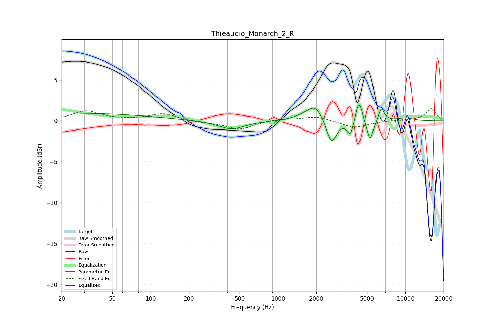

# Thieaudio_Monarch_2_R
See [usage instructions](https://github.com/jaakkopasanen/AutoEq#usage) for more options and info.

### Parametric EQs
Apply preamp of -2.1 dB when using parametric equalizer.

|   # | Type    |   Fc (Hz) |    Q |   Gain (dB) |
|-----|---------|-----------|------|-------------|
|   1 | Peaking |        21 | 0.18 |         0.9 |
|   2 | Peaking |       431 | 1.39 |        -1.1 |
|   3 | Peaking |      1653 | 1.7  |         0.5 |
|   4 | Peaking |      1980 | 2.47 |         1.7 |
|   5 | Peaking |      2627 | 3.61 |        -3.1 |
|   6 | Peaking |      3687 | 5.99 |        -1.8 |
|   7 | Peaking |      4324 | 6    |         2.7 |
|   8 | Peaking |      5293 | 5.86 |        -2.6 |
|   9 | Peaking |      6486 | 6    |         1.6 |
|  10 | Peaking |     10000 | 1.88 |         0.4 |

### Fixed Band EQs
When using fixed band (also called graphic) equalizer, apply preamp of **-1.6 dB** (if available) and set gains manually with these parameters.

|   # | Type    |   Fc (Hz) |    Q |   Gain (dB) |
|-----|---------|-----------|------|-------------|
|   1 | Peaking |        31 | 1.41 |         1.2 |
|   2 | Peaking |        62 | 1.41 |         0.1 |
|   3 | Peaking |       125 | 1.41 |         0.9 |
|   4 | Peaking |       250 | 1.41 |        -0.2 |
|   5 | Peaking |       500 | 1.41 |        -1   |
|   6 | Peaking |      1000 | 1.41 |         0.3 |
|   7 | Peaking |      2000 | 1.41 |         0.6 |
|   8 | Peaking |      4000 | 1.41 |        -0.9 |
|   9 | Peaking |      8000 | 1.41 |         0   |
|  10 | Peaking |     16000 | 1.41 |         1.5 |

### Graphs

