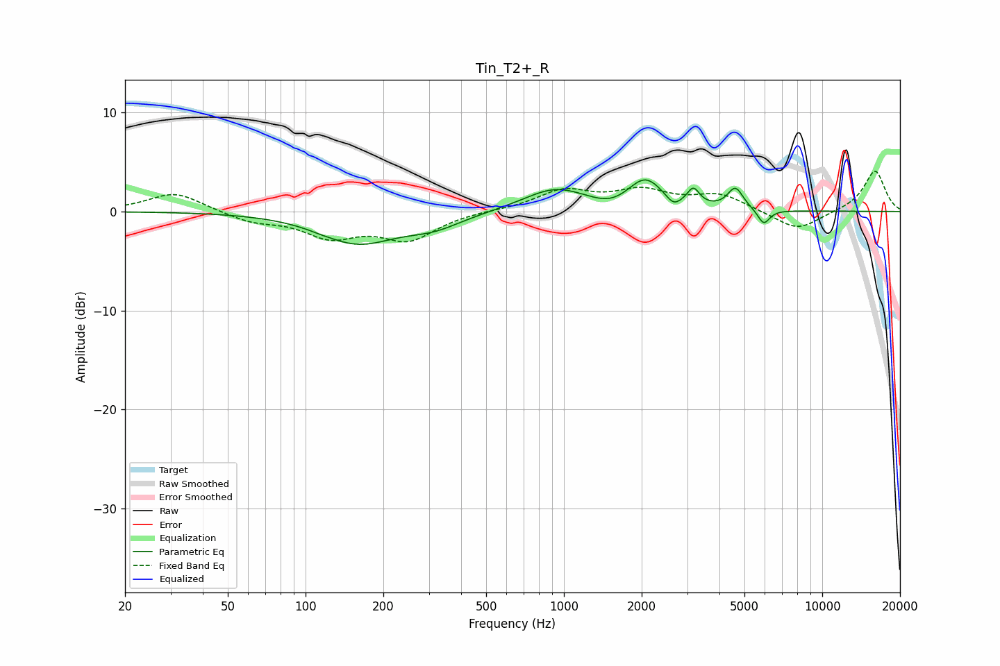

# Tin_T2+_R
See [usage instructions](https://github.com/jaakkopasanen/AutoEq#usage) for more options and info.

### Parametric EQs
Apply preamp of -3.3 dB when using parametric equalizer.

|   # | Type    |   Fc (Hz) |    Q |   Gain (dB) |
|-----|---------|-----------|------|-------------|
|   1 | Peaking |       113 | 5.14 |        -0.1 |
|   2 | Peaking |       159 | 0.95 |        -3.1 |
|   3 | Peaking |       314 | 1.27 |        -1.3 |
|   4 | Peaking |       928 | 1.13 |         2.3 |
|   5 | Peaking |      1520 | 1.91 |        -0.7 |
|   6 | Peaking |      2066 | 2.09 |         3.1 |
|   7 | Peaking |      2656 | 5.13 |        -0.9 |
|   8 | Peaking |      3171 | 6    |         1.7 |
|   9 | Peaking |      4612 | 4.63 |         2.2 |
|  10 | Peaking |      5935 | 5.96 |        -1.5 |

### Fixed Band EQs
When using fixed band (also called graphic) equalizer, apply preamp of **-4.2 dB** (if available) and set gains manually with these parameters.

|   # | Type    |   Fc (Hz) |    Q |   Gain (dB) |
|-----|---------|-----------|------|-------------|
|   1 | Peaking |        31 | 1.41 |         2   |
|   2 | Peaking |        62 | 1.41 |        -1   |
|   3 | Peaking |       125 | 1.41 |        -2.3 |
|   4 | Peaking |       250 | 1.41 |        -2.7 |
|   5 | Peaking |       500 | 1.41 |         0.1 |
|   6 | Peaking |      1000 | 1.41 |         2   |
|   7 | Peaking |      2000 | 1.41 |         1.9 |
|   8 | Peaking |      4000 | 1.41 |         1.6 |
|   9 | Peaking |      8000 | 1.41 |        -2   |
|  10 | Peaking |     16000 | 1.41 |         4.1 |

### Graphs

