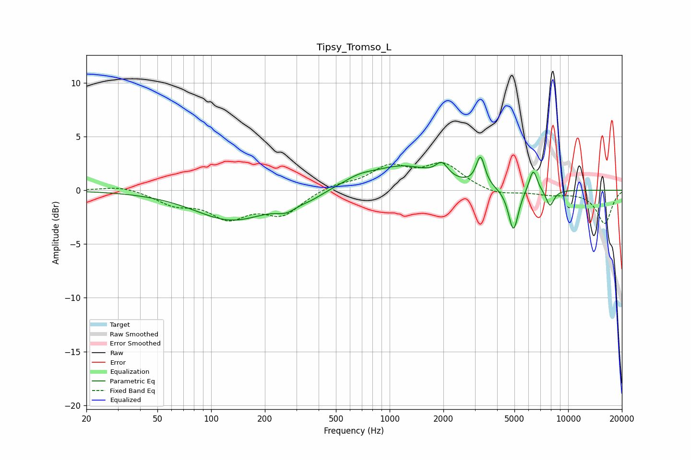

# Tipsy_Tromso_L
See [usage instructions](https://github.com/jaakkopasanen/AutoEq#usage) for more options and info.

### Parametric EQs
Apply preamp of -3.2 dB when using parametric equalizer.

|   # | Type    |   Fc (Hz) |    Q |   Gain (dB) |
|-----|---------|-----------|------|-------------|
|   1 | Peaking |       131 | 0.68 |        -2.7 |
|   2 | Peaking |       265 | 2.29 |        -0.9 |
|   3 | Peaking |       366 | 2.28 |        -0.4 |
|   4 | Peaking |       669 | 1.67 |         0.6 |
|   5 | Peaking |      1180 | 0.78 |         2.2 |
|   6 | Peaking |      1960 | 4.21 |         1.3 |
|   7 | Peaking |      3228 | 5.9  |         2.7 |
|   8 | Peaking |      4936 | 5.08 |        -4   |
|   9 | Peaking |      6370 | 6    |         2.1 |
|  10 | Peaking |      7914 | 5.86 |        -1.5 |

### Fixed Band EQs
When using fixed band (also called graphic) equalizer, apply preamp of **-2.7 dB** (if available) and set gains manually with these parameters.

|   # | Type    |   Fc (Hz) |    Q |   Gain (dB) |
|-----|---------|-----------|------|-------------|
|   1 | Peaking |        31 | 1.41 |         0.5 |
|   2 | Peaking |        62 | 1.41 |        -1.2 |
|   3 | Peaking |       125 | 1.41 |        -2.3 |
|   4 | Peaking |       250 | 1.41 |        -2.1 |
|   5 | Peaking |       500 | 1.41 |         0.5 |
|   6 | Peaking |      1000 | 1.41 |         2   |
|   7 | Peaking |      2000 | 1.41 |         2.3 |
|   8 | Peaking |      4000 | 1.41 |        -0.5 |
|   9 | Peaking |      8000 | 1.41 |        -0.4 |
|  10 | Peaking |     16000 | 1.41 |        -3.1 |

### Graphs

