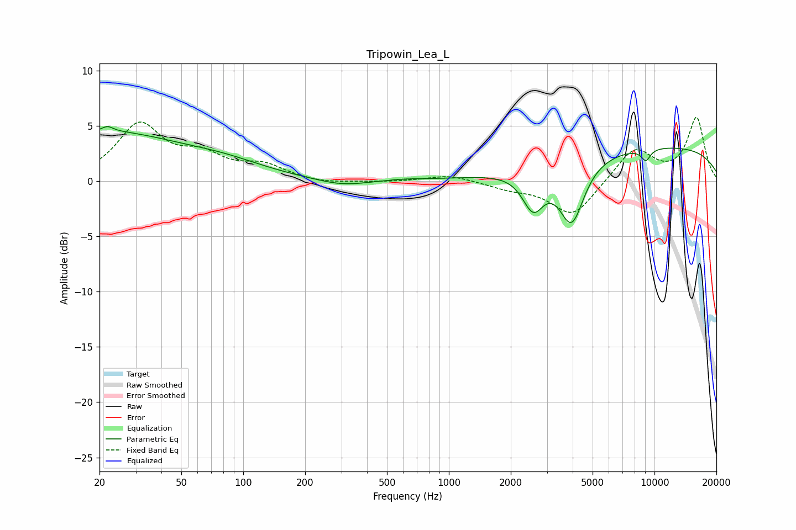

# Tripowin_Lea_L
See [usage instructions](https://github.com/jaakkopasanen/AutoEq#usage) for more options and info.

### Parametric EQs
Apply preamp of -5.0 dB when using parametric equalizer.

|   # | Type    |   Fc (Hz) |    Q |   Gain (dB) |
|-----|---------|-----------|------|-------------|
|   1 | Peaking |        21 | 0.36 |         4.3 |
|   2 | Peaking |        22 | 6    |        -2   |
|   3 | Peaking |        22 | 5.84 |         2.5 |
|   4 | Peaking |        82 | 0.7  |         1   |
|   5 | Peaking |       304 | 1.13 |        -0.6 |
|   6 | Peaking |       605 | 1.38 |         0.1 |
|   7 | Peaking |      2572 | 2.68 |        -3.4 |
|   8 | Peaking |      3955 | 2.31 |        -5.6 |
|   9 | Peaking |      9082 | 5.67 |        -1.1 |
|  10 | Peaking |     10000 | 0.21 |         3.2 |

### Fixed Band EQs
When using fixed band (also called graphic) equalizer, apply preamp of **-5.9 dB** (if available) and set gains manually with these parameters.

|   # | Type    |   Fc (Hz) |    Q |   Gain (dB) |
|-----|---------|-----------|------|-------------|
|   1 | Peaking |        31 | 1.41 |         4.9 |
|   2 | Peaking |        62 | 1.41 |         1.9 |
|   3 | Peaking |       125 | 1.41 |         1.3 |
|   4 | Peaking |       250 | 1.41 |        -0.3 |
|   5 | Peaking |       500 | 1.41 |        -0.1 |
|   6 | Peaking |      1000 | 1.41 |         0.6 |
|   7 | Peaking |      2000 | 1.41 |        -0.6 |
|   8 | Peaking |      4000 | 1.41 |        -3.2 |
|   9 | Peaking |      8000 | 1.41 |         3   |
|  10 | Peaking |     16000 | 1.41 |         5.7 |

### Graphs

